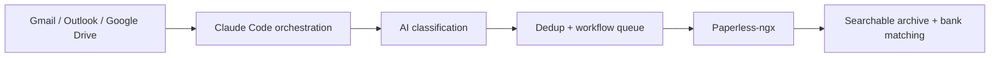
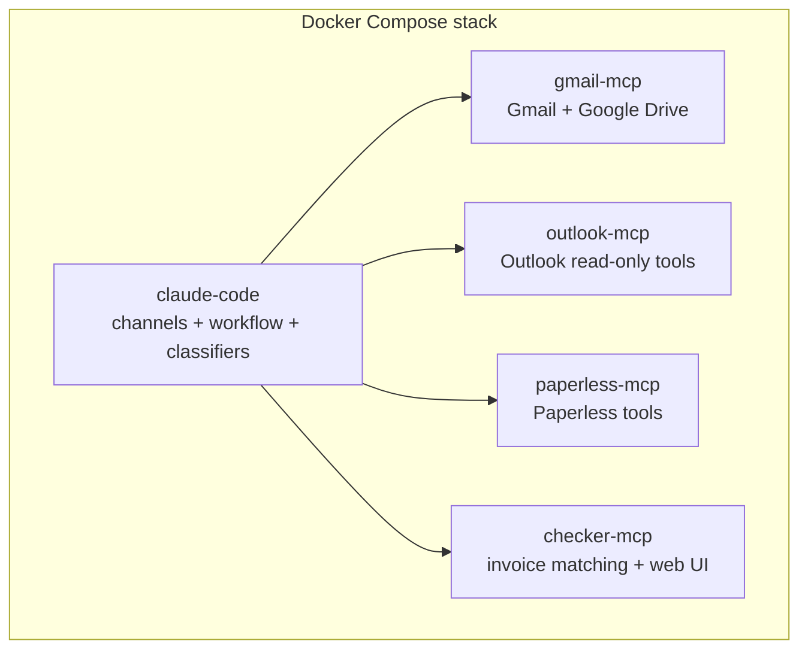

# Personal Assistant

AI document assistant for self-hosters that watches Gmail, Outlook, and Google Drive, classifies invoices and documents, and files them into [Paperless-ngx](https://github.com/paperless-ngx/paperless-ngx) with the right metadata.

Use it to stop manually downloading invoices, renaming PDFs, tagging scans, and checking whether a payment already has a matching document.

- Automatically picks up invoices from Gmail, Outlook, and Google Drive
- Extracts vendor, amount, document type, and ownership with Claude-powered classification
- Uploads to Paperless-ngx with correspondents, tags, and custom fields
- Detects likely duplicates before upload
- Matches bank statement movements against stored invoices
- Exposes metrics, dashboards, and workflow health checks



## Why this exists

Most invoice automation stops at "download the attachment." This project goes further:

- it understands both email and scanned-document intake
- it routes business vs personal documents differently
- it keeps an audit trail and durable workflow state
- it supports human approval where ambiguity matters
- it adds an invoice-matching layer for month-end checks

## Who this is for

- People already running or planning to run Paperless-ngx
- Self-hosters who want practical document automation instead of a generic AI demo
- Users comfortable with Docker Compose, API tokens, and OAuth/device-code auth flows

This project is probably not the right fit if you want a single-binary desktop app or a no-config SaaS workflow.

## Quick start

1. Copy the example environment file.
2. Start the local profile.
3. Create a Paperless API token.
4. Authenticate Claude and any inbox providers you want to use.
5. Drop in a test invoice or send a test email.

```bash
cp .env.example .env
docker compose --profile local --env-file .env up --build
docker exec -it personal-assistant-claude claude login
```

Then follow the **[Complete Setup Guide](docs/SETUP.md)** — it walks through Google/Microsoft OAuth app creation, Paperless configuration, all authentication flows, and first-run verification.

## What it does

### Intake and ingestion

- Polls Gmail and Outlook for new invoice emails
- Watches Google Drive folders for scanned documents
- Downloads attachments or invoice links when appropriate
- Decrypts password-protected PDFs when configured

### AI-assisted classification

- Uses a fast email classifier to decide whether to ignore, notify, or process
- Uses a document classifier to extract vendor, total amount, document type, and owner
- Merges metadata before upload so Paperless receives cleaner structured data

### Paperless workflow

- Resolves correspondents and tags
- Uploads through the Paperless API
- Stores workflow state in SQLite so jobs survive restarts
- Detects likely duplicates and pauses for approval when needed

### Matching and accountant workflow

- Matches statement movements against Paperless invoices
- Shows missing or unresolved movements
- Produces annual P&L summaries

### Observability

- Exposes Prometheus metrics and health endpoints
- Forwards OpenTelemetry data to an OTLP endpoint
- Includes local Grafana, Prometheus, Loki, and Alloy in the `local` profile

## Architecture at a glance



For the full pipeline and service layout, see `docs/architecture.md`.

## Documentation map

Start with the doc that matches what you need:

| If you want to... | Read |
|---|---|
| get the stack running locally | `docs/getting-started.md` |
| understand environment variables and auth | `docs/configuration.md` |
| understand the pipeline and containers | `docs/architecture.md` |
| see supported workflows | `docs/USE_CASES.md` |
| run tests and contribute | `docs/development.md` |
| set up dashboards and telemetry | `docs/observability.md` |
| troubleshoot auth, health, or pipeline issues | `docs/troubleshooting.md` |
| inspect the full maintainer reference | `CLAUDE.md` |

Detailed deep dives are also available:

- `docs/uc1-invoice-processing.md`
- `docs/uc1a-observability.md`
- `docs/uc2-invoice-matching.md`
- `docs/infrastructure.md`

## Prerequisites

- Docker and Docker Compose
- A Paperless-ngx instance and API token
- Claude Code access for the `claude-code` container
- At least one inbox source:
  - Gmail via Google OAuth desktop credentials
  - Outlook via Azure app registration with `Mail.Read`
- Optional: Telegram bot token, Google Drive access, OTLP endpoint

## Configuration overview

Configuration lives in `.env`. See `.env.example` for the full commented list.

Important groups:

| Group | Variables |
|---|---|
| Paperless | `PAPERLESS_URL`, `PAPERLESS_API_TOKEN` |
| Gmail | `GOOGLE_OAUTH_CLIENT_ID`, `GOOGLE_OAUTH_CLIENT_SECRET`, `GMAIL_EMAIL` |
| Outlook | `AZURE_CLIENT_ID`, `OUTLOOK_ENABLED` |
| Telegram | `TELEGRAM_BOT_TOKEN`, `TELEGRAM_CHAT_ID` |
| Business identity | `BUSINESS_COMPANY_NAME`, `BUSINESS_TAX_IDS`, `BUSINESS_CRN` |
| Google Drive | `GDRIVE_LEVEL1`, `GDRIVE_LEVEL2`, `GDRIVE_MCP_URL` |
| Polling | `POLL_INTERVAL_MS`, `GDRIVE_POLL_INTERVAL_MS`, `WORKFLOW_POLL_MS` |
| Telemetry | `OTEL_ENDPOINT`, `OTEL_METRIC_INTERVAL` |

## Testing

```bash
# TypeScript channels and workflow
cd claude-code/channels
bun install
bun test

# Python invoice matching
cd ../../checker-mcp
python -m pytest test_matching.py -v

# End-to-end pipeline tests
cd ..
python -m pytest tests/ -v --timeout=300
```

See `docs/development.md` for prerequisites, test setup, and troubleshooting.

## Security and contribution docs

- `CONTRIBUTING.md`
- `SECURITY.md`
- `CODE_OF_CONDUCT.md`

## Project status

This project is functional and actively used, but it is still opinionated toward self-hosted Paperless workflows and Claude Code orchestration.

Expect to adapt:

- OAuth app setup
- Paperless document types and custom fields
- tag naming conventions
- storage paths and reverse proxy details

Public docs use realistic placeholders such as `documents.lan`, `gmail-mcp.lan`, `/mnt/shared_configs/<stack>/`, and `YOUR_OTEL_ENDPOINT`.

## License

MIT. See `LICENSE`.
