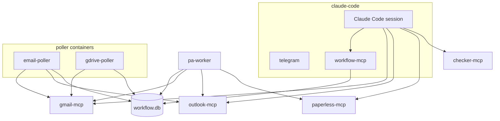

# Architecture

This project runs one Docker Compose stack with Claude Code orchestrating both channel-style event streams and MCP tool servers.

## Service overview

## Main pieces

### `claude-code`

Runs the Claude session in `tmux` and hosts:

- `telegram`
- `workflow-mcp`
- the Haiku-based classifier prompts

See [claude-code-runtime.md](claude-code-runtime.md) for the entrypoint phases, the HTTP MCP reconnect workaround, and the gotchas baked into `entrypoint.sh`.

### `email-poller`

Standalone Bun container (`oven/bun:1-alpine`) that polls Gmail + Outlook every `POLL_INTERVAL_MS` (default 30s). Writes to `emails.db` (audit trail) and `workflow.db` (creates `invoice_intake` jobs). On first run, seeds `last_checked` from `INITIAL_LOOKBACK` instead of prompting Claude. Source: `pollers/email-poller/src/main.ts`.

### `gdrive-poller`

Standalone Bun container (`oven/bun:1-alpine`) that polls Google Drive folders (`GDRIVE_LEVEL1` × `GDRIVE_LEVEL2`) every 30s via gmail-mcp. Writes to `gdrive.db` (audit trail) and `workflow.db` (creates `scan_intake` jobs). Source: `pollers/gdrive-poller/src/main.ts`.

### `pa-worker`

Standalone Bun container (`oven/bun:1-alpine`) that runs the durable job executor extracted from `workflow-mcp` by task 64. Polls `workflow.db` every `WORKFLOW_POLL_MS` (default 2s) — claims queued jobs, reclaims stale ones, runs the invoice/scan pipelines, sweeps stale guidance jobs (24h reminder / 72h auto-fail), sweeps orphaned downloads on boot, and posts outbound Telegram notifications. Communicates with `workflow-mcp` (in `claude-code`) only via the shared `workflow.db` SQLite WAL. Health endpoint `/health` on `:8003`. Source: `claude-code/channels/worker.ts`. Decoupling the worker from the Claude container removes the v2.1.x MCP-spawn race as a failure mode for job execution.

### `paperless-mcp`

Exposes Paperless tools over MCP so the stack can create or query documents and metadata.

### `checker-mcp`

Wraps invoice matching and P&L logic and also serves a small web UI.

### `gmail-mcp`

Provides Gmail and Google Drive access.

### `outlook-mcp`

Provides read-only Outlook mail access with device-code authentication.

## Pipeline summary

1. A poller (email-poller or gdrive-poller) detects a new email or Drive file and writes a job to `workflow.db`.
2. Claude classifies the item.
3. The workflow layer downloads or reads the document.
4. The worker resolves tags, correspondents, and duplicates.
5. The document is uploaded to Paperless.
6. Metrics, audit trails, and notifications are updated.

## Reliability features

- Docker health checks for all services
- durable workflow state in SQLite
- retry logic for transient MCP network errors
- stateless HTTP mode for custom MCP servers where possible
- restart-safe job execution and email auditing

## Design decisions

### Worker as orchestrator, Claude as tool

The invoice-worker is deterministic code that drives the full pipeline. Claude is called only for classification (via channel events) and is not in the decision loop for downloading, deduplication, tagging, or uploading. This keeps the pipeline predictable and testable — all branching logic lives in TypeScript, not in LLM prompts.

### Files saved to disk before classification

The worker downloads PDFs to `/workspace/downloads/` before requesting document classification. The document-classifier Haiku subagent needs visual access to the file via Claude's `Read` tool, which reads from the local filesystem. Passing base64 content through the channel would exceed practical message sizes.

### Classification re-queues jobs (not resumes them)

`submitClassification` sets the job state back to `queued`, not `running`. This lets `claimNextQueuedJob` pick it up naturally on the next worker tick (≤2s). The alternative — resuming in the same execution context — would require holding the worker thread open during classification, blocking all other jobs.

### Stale job detection

Every worker tick scans for jobs stuck in `running` or `awaiting_classification` for over 5 minutes. Stuck jobs are either retried (if retry budget remains) or failed. This handles cases where Claude's classification response is lost or the worker crashes mid-execution.

### Three-layer idempotency

Each input path has three dedup layers:

1. **Source DB** — `emailExists()` / `fileExists()` prevents duplicate audit rows
2. **Workflow DB** — `idempotency_key` UNIQUE constraint prevents duplicate jobs
3. **Classification** — `submitClassification` deduplicates `step_completed` events

A container restart mid-pipeline creates no duplicates. The worker resumes from the last completed step.

### Step-level resume

`getCompletedSteps` reads all `step_completed` events from the job ledger and builds a Map. On retry, the worker skips completed steps. Downloaded files are saved to disk and the path recorded in the step event — no re-download on retry.

### Deduplication requires order_id

`checkDuplicate` only runs when `order_id` is present (from the classifier). Documents without order_id (utility bills, generic receipts) rely on Paperless's built-in content-hash deduplication. This is a deliberate tradeoff — fuzzy dedup without order_id would produce too many false positives.

### Notification errors are non-fatal

Telegram notification calls use `.catch(() => {})`. A successful upload is never rolled back because of a notification failure. The tradeoff is that Telegram outages are currently silent — no OTel span or metric tracks notification failures.

### Single-worker model

A `workerBusy` flag ensures only one job executes at a time. This avoids concurrent Paperless API calls and keeps the implementation simple. At current volume (10–50 emails/day), the worst-case added latency from queuing is ~5s per classification roundtrip. Parallel workers would require proper locking on `claimNextQueuedJob`.

### Retry backoff

Failed jobs use exponential backoff: `attempt⁴ × (0.9 + random × 0.2)` seconds. Default 3 retries. The jitter prevents thundering herd on transient failures.

### curl for GDrive downloads

`downloadFromGdrive` uses `execSync("curl ...")` instead of `fetch()`. The Gmail MCP returns download URLs with `localhost:8000` which needs Docker hostname rewriting. A `fetch()` approach would be cleaner but would require URL rewriting logic that curl handles implicitly through the Docker network.

### Pollers create jobs directly

Email-poller (`pollers/email-poller/src/main.ts`) and gdrive-poller (`pollers/gdrive-poller/src/main.ts`) import `createJob` from `pollers/lib/workflow-db.ts` and insert jobs into SQLite directly — Claude is not in the job creation path. MCP tools (`create_invoice_intake_job`, `create_scan_intake_job`) remain available for manual reprocessing and `force=true` retry.

## Deep dives

- `docs/uc1-invoice-processing.md`
- `docs/uc2-invoice-matching.md`
- `docs/infrastructure.md`
- `CLAUDE.md`
