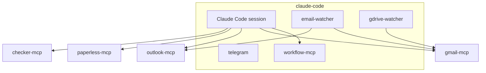

# Architecture

This project runs one Docker Compose stack with Claude Code orchestrating both channel-style event streams and MCP tool servers.

## Service overview

## Main pieces

### `claude-code`

Runs the Claude session in `tmux` and hosts:

- `email-watcher`
- `gdrive-watcher`
- `telegram`
- `workflow-mcp`
- the Haiku-based classifier prompts

### `paperless-mcp`

Exposes Paperless tools over MCP so the stack can create or query documents and metadata.

### `checker-mcp`

Wraps invoice matching and P&L logic and also serves a small web UI.

### `gmail-mcp`

Provides Gmail and Google Drive access.

### `outlook-mcp`

Provides read-only Outlook mail access with device-code authentication.

## Pipeline summary

1. A watcher detects a new email or Drive file.
2. Claude classifies the item.
3. The workflow layer downloads or reads the document.
4. The worker resolves tags, correspondents, and duplicates.
5. The document is uploaded to Paperless.
6. Metrics, audit trails, and notifications are updated.

## Reliability features

- Docker health checks for all services
- durable workflow state in SQLite
- retry logic for transient MCP network errors
- stateless HTTP mode for custom MCP servers where possible
- restart-safe job execution and email auditing

## Deep dives

- `docs/uc1-invoice-processing.md`
- `docs/uc2-invoice-matching.md`
- `docs/infrastructure.md`
- `CLAUDE.md`
