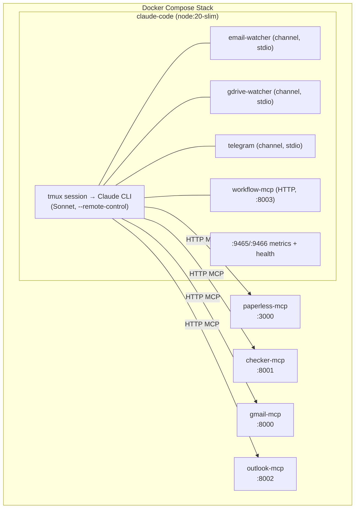

# Infrastructure & Non-Functional

Everything that makes the stack run but isn't a user-facing use case: build, deploy, auth, health, resilience, persistence.

## Stack Overview

5 services, all in one Docker Compose stack:



**Config:** [`docker-compose.yml`](../docker-compose.yml) — full stack. Production runs without profile; local dev uses `--profile local` for build contexts + observability sidecar.

## Docker Build

Single Dockerfile builds the `claude-code` container.

**Base:** `node:20-slim` with git, curl, tmux, jq, qpdf.

**Layers:**
1. Install Bun as `node` user (channels runtime)
2. Install Claude Code CLI globally (`@anthropic-ai/claude-code@${CLAUDE_CODE_VERSION}`)
3. Copy channel scripts + `bun install`
4. Clone official Telegram plugin from `github.com/anthropics/claude-plugins-official`
5. Copy `.mcp.json`, `CLAUDE.md`, agents, `.claude.json`, `entrypoint.sh`

**Code:** [`Dockerfile`](../claude-code/Dockerfile) — 50 lines, non-root user (`node`), multi-stage USER switches.

**Other images:**
- `checker-mcp` and `outlook-mcp` — local Python builds via Komodo
- `paperless-mcp` — community image `ghcr.io/baruchiro/paperless-mcp:latest`
- `gmail-mcp` — community image `ghcr.io/taylorwilsdon/google_workspace_mcp:1.16.2`

## Komodo Deployment

The stack deploys to **infra LXC** (192.168.0.112) via Komodo.

**3 builds:**
1. `claude-code` — Dockerfile in `claude-code/`
2. `checker-mcp` — Dockerfile in `checker-mcp/`
3. `outlook-mcp` — Dockerfile in `outlook-mcp/`

Builds are tagged by git commit. Komodo syncs compose files and triggers builds + stack deploy.

**Procedure:** Run builds, then deploy the stack. Community images are pulled at deploy time (subject to version pinning).

## Authentication

Four independent auth flows, each persisting tokens on NAS.

### Claude Login
```bash
docker exec -it personal-assistant-claude claude login
```
One-time browser login. Credentials persist in `/mnt/shared_configs/personal-assistant/claude-config/`.

### Gmail OAuth
Trigger `start_google_auth` tool from inside the Claude session. OAuth callback via `https://gmail-mcp.lacny.me/oauth2callback` (Caddy-routed, caddy label on gmail-mcp container). Tokens in `/mnt/shared_configs/personal-assistant/gmail/`.

**Config:** [`docker-compose.yml:116-119`](../docker-compose.yml#L116) — OAuth env vars (client ID, secret, redirect URI).

### Outlook MSAL Device Code
Restart outlook-mcp container → check logs for device code URL. Enter code at Microsoft login page. Tokens in `/mnt/shared_configs/personal-assistant/outlook/token_cache.json`.

**Code:** [`outlook-mcp/server.py:31-94`](../outlook-mcp/server.py#L31) — MSAL cache load/save, device code flow, silent token acquisition.

### Telegram Pairing
DM the bot. `access.json` in the NAS volume handles chat allowlisting. `TELEGRAM_BOT_TOKEN` and `TELEGRAM_CHAT_ID` env vars configure the bot.

## Health Checks

All 5 services have Docker health checks. `claude-code` depends on all MCPs via `depends_on: service_healthy` — won't start until all MCPs are ready.

| Service | Check | Interval | Start period |
|---------|-------|----------|--------------|
| `claude-code` | tmux alive + `curl :9465/health` | 30s | 90s |
| `checker-mcp` | TCP :8001 | 30s | 15s |
| `outlook-mcp` | TCP :8002 | 30s | 30s |
| `paperless-mcp` | TCP :3000 (Node) | 30s | 15s |
| `gmail-mcp` | TCP :8000 (Python) | 30s | 15s |

**Staleness detection:** email-watcher `/health` returns 503 if no successful poll in `POLL_INTERVAL_MS * 5` (default 2.5 min). Catches MCP connectivity loss and email-watcher hangs.

**Code:** [`email-watcher.ts:322-340`](../claude-code/channels/email-watcher.ts#L322) — health endpoint with staleness check.

## Restart Resilience

Three layers ensure the system recovers from crashes:

### 1. Docker restart policy
All services use `restart: unless-stopped`. When the tmux session dies, `entrypoint.sh` exits with code 1, triggering restart.

**Code:** [`entrypoint.sh:65-69`](../claude-code/entrypoint.sh#L65) — tmux watchdog loop: `while tmux has-session ... sleep 10`.

### 2. Entrypoint prompt detection
The entrypoint detects and accepts two TUI prompts:
1. Development channels prompt ("local development") — polls up to 60s
2. New MCP server prompt ("new.*mcp", "trust", "approve") — polls 10s after

**Code:** [`entrypoint.sh:29-58`](../claude-code/entrypoint.sh#L29) — prompt polling with tmux `capture-pane` + grep + `send-keys Enter`.

### 3. Durable workflow DB
Jobs in `workflow.db` persist across restarts. On startup, the worker resumes queued jobs automatically.

**Code:** [`workflow-db.ts:46-78`](../claude-code/channels/workflow-db.ts#L46) — SQLite schema with `state` column tracking job lifecycle.

## Stateless MCP

Custom servers (`checker-mcp`, `outlook-mcp`) run with `FASTMCP_STATELESS_HTTP=true`:
- No MCP session IDs assigned
- Server restarts transparent to Claude (no session to lose)
- Works around [Claude Code bug #27142](https://github.com/anthropics/claude-code/issues/27142) where cached session IDs cause permanent tool failures after restart

Community servers (`paperless-mcp`, `gmail-mcp`) may use stateful sessions — if they restart, restart `claude-code` too.

**Config:** [`docker-compose.yml:94`](../docker-compose.yml#L94) (checker-mcp), [`docker-compose.yml:149`](../docker-compose.yml#L149) (outlook-mcp).

## Persistence

All state persists on NAS at `/mnt/shared_configs/personal-assistant/`:

| Path | Content |
|------|---------|
| `claude-config/` | Claude credentials, settings, Telegram state |
| `downloads/` | Downloaded invoice files |
| `email-watcher/` | `emails.db` (audit trail), `workflow.db` (job queue) |
| `gdrive-watcher/` | `gdrive.db` (GDrive file audit trail) |
| `gmail/` | Gmail OAuth tokens |
| `outlook/` | Outlook MSAL token cache |

**Config:** [`docker-compose.yml:27-30`](../docker-compose.yml#L27) — volume mounts.

NAS: WD MyCloud at 192.168.0.79, NFS → PVE host → bind mount into LXC → Docker volume.

## Version Management

| Image | Strategy |
|-------|----------|
| `claude-code`, `checker-mcp`, `outlook-mcp` | Local Komodo builds, tagged by git commit |
| `gmail-mcp` | Pinned to `1.14.3` (semver tags on GHCR) |
| `paperless-mcp` | `:latest` (no semver tags available) |

**Watchtower:** All services have `com.centurylinklabs.watchtower.monitor: "false"` — no mid-session auto-updates.

**Code:** [`docker-compose.yml:7`](../docker-compose.yml#L7), [`docker-compose.yml:67`](../docker-compose.yml#L67), etc. — watchtower labels on every service.

## MCP Server Configuration

7 MCP servers configured in [`.mcp.json`](../claude-code/.mcp.json):

| Server | Type | Transport |
|--------|------|-----------|
| `email-watcher` | channel | stdio (bun) |
| `gdrive-watcher` | channel | stdio (bun) |
| `telegram` | channel | stdio (bun, official plugin) |
| `workflow` | tool server | HTTP `:8003/mcp` (inside claude-code container) |
| `paperless` | tool server | HTTP `:3000/mcp` |
| `checker` | tool server | HTTP `:8001/mcp` |
| `gmail` | tool server | HTTP `:8000/mcp` |
| `outlook` | tool server | HTTP `:8002/mcp` |

Channels are stdio subprocesses of Claude Code — they MUST run in the same container. HTTP tool servers are separate containers connected via Docker networking, except `workflow` which runs inside the `claude-code` container as a co-process on port 8003.

### MCP Client Retry Logic

The `mcp-client.ts` HTTP client wraps all tool calls with retry logic for transient network errors:
- **Retries:** 3 attempts with exponential backoff (1s, 2s, 4s)
- **Transient errors:** connection refused, DNS failures, timeouts, connection reset
- **Non-transient errors:** thrown immediately (HTTP 4xx/5xx, auth failures)
- **Observability:** retry attempts logged as OTel span events

**Code:** [`mcp-client.ts:32-108`](../claude-code/channels/mcp-client.ts#L32) — `isTransientNetworkError()`, `callMcpTool()` retry wrapper.

## Model Strategy

- **Main session:** Sonnet — handles orchestration, Telegram conversation, complex decisions
- **Subagents:** Haiku — fast/cheap classification and processing
  - `email-classifier.md` — classifies email intent, vendor, download strategy
  - `document-classifier.md` — classifies documents from both email and GDrive paths (extracts vendor, amount, doc_type from PDF via vision)
