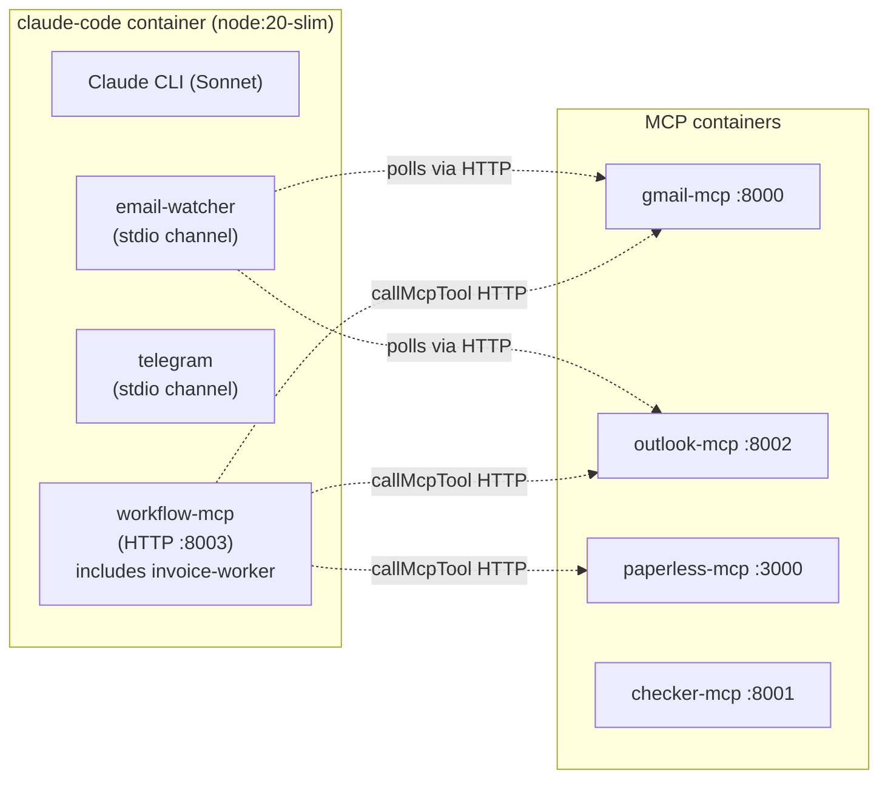
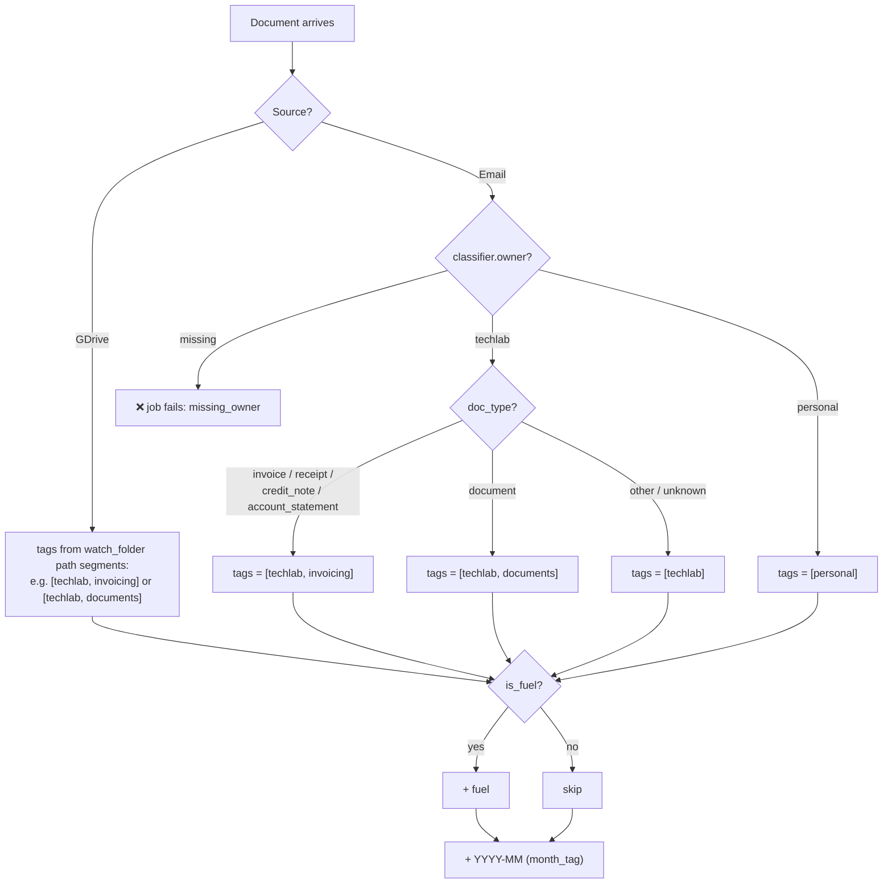
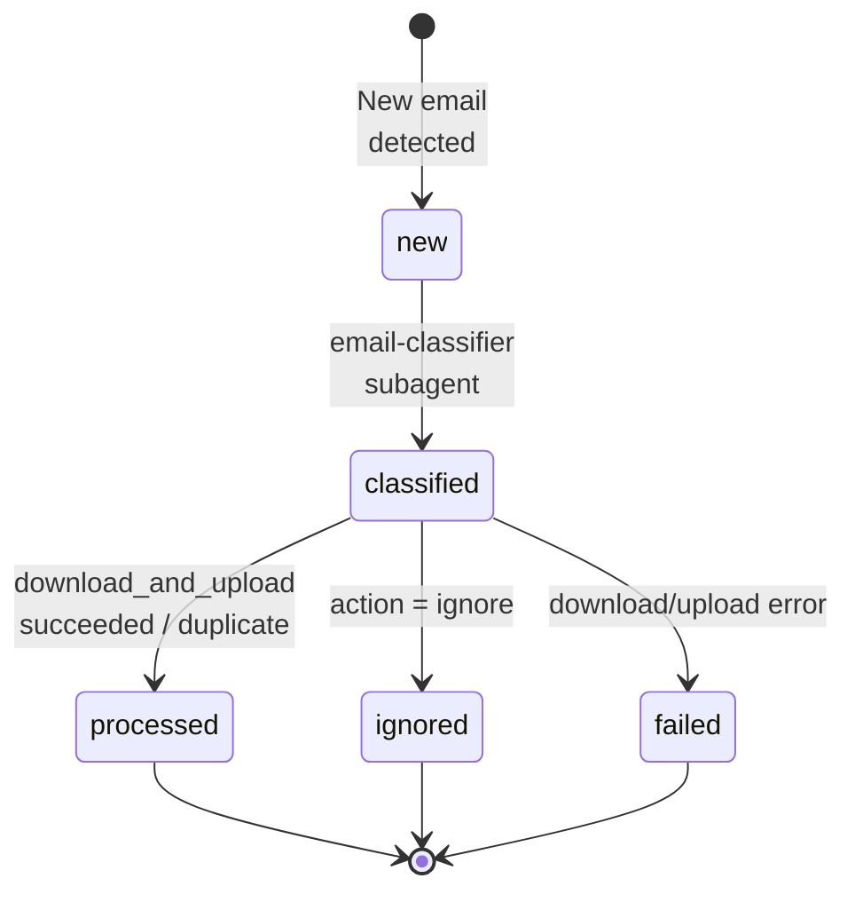
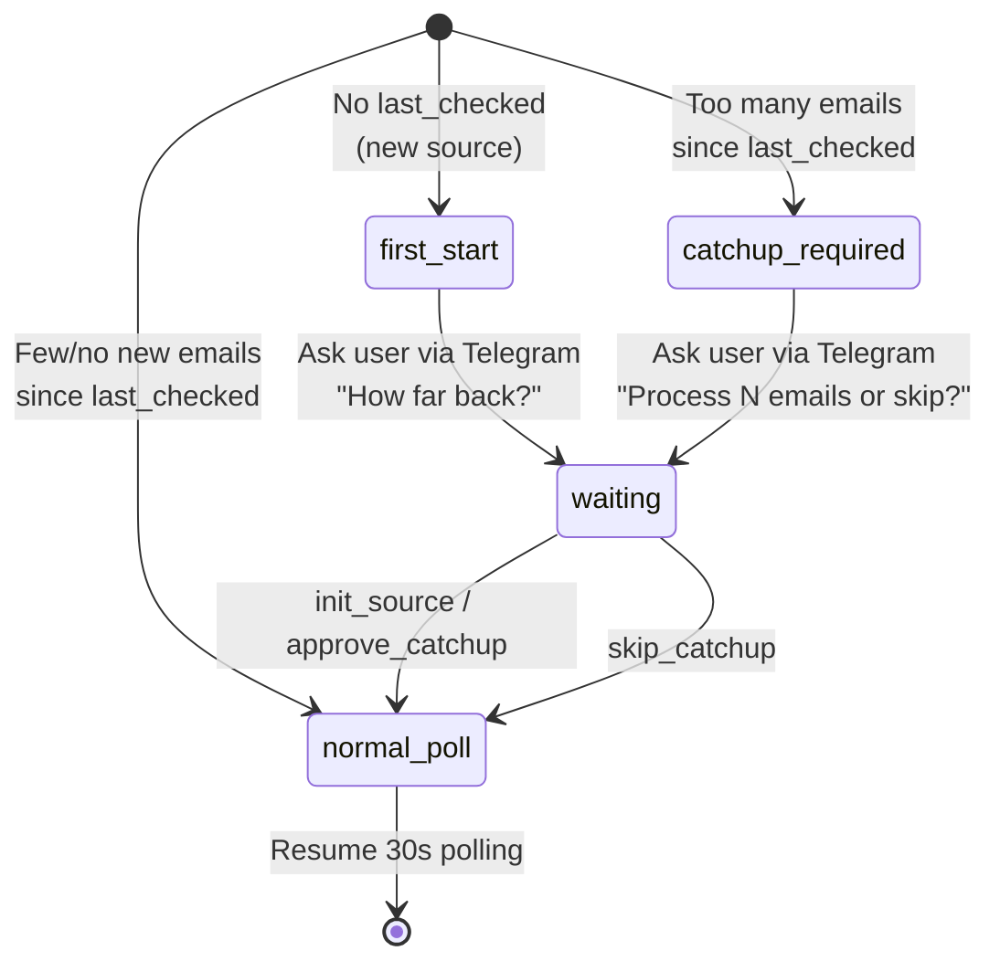

# UC-1: Invoice Processing (email → Paperless)

Automated pipeline: poll Gmail + Outlook → classify email with Haiku → download PDF → classify document with Haiku → process via durable workflow → upload to Paperless-ngx → notify via Telegram.

## Architecture

### Container Boundaries



### Pipeline Flow

```mermaid
sequenceDiagram
    participant G as Gmail/Outlook MCPs
    participant EW as email-watcher<br/>(channel)
    participant DB as SQLite
    participant C as Claude (Sonnet)
    participant CL as email-classifier<br/>(Haiku)
    participant DC as document-classifier<br/>(Haiku)
    participant WF as workflow-mcp
    participant IW as invoice-worker
    participant P as Paperless MCP
    participant TG as Telegram

    rect rgb(40, 40, 60)
    note over G,TG: Startup — first run (no last_checked for source)
    EW->>DB: getLastChecked(source)?
    DB-->>EW: null
    EW--)C: channel event<br/>(event_type: first_start)
    note over C: Ask user via Telegram:<br/>"How far back to check?"
    C->>EW: init_source(source, since)
    EW->>DB: INSERT source_state(last_checked)
    end

    rect rgb(40, 40, 60)
    note over G,TG: Startup — catchup required (too many since last_checked)
    EW->>DB: getLastChecked(source)?
    DB-->>EW: timestamp
    G-->>EW: emails[] (count > threshold)
    EW--)C: channel event<br/>(event_type: catchup_required, count: N)
    note over C: Ask user via Telegram:<br/>"Process all N or skip?"
    C->>EW: approve_catchup(source) | skip_catchup(source)
    end

    rect rgb(40, 40, 60)
    note over G,TG: Normal poll — new email detected
    loop Every 30s
        EW->>G: poll (since last_checked)
        G-->>EW: emails[]
    end
    EW->>DB: emailExists(id)?
    DB-->>EW: false
    EW->>DB: INSERT status="new"
    EW--)C: channel notification<br/>(sender, subject, message_id, source)
    EW->>DB: setLastChecked(source, now)
    end

    rect rgb(50, 40, 40)
    note over C,CL: Step 1 — Classify
    C->>CL: dispatch (email metadata)
    CL-->>C: JSON {is_invoice, confidence,<br/>vendor, action, doc_type}
    C->>EW: update_email_status(id,<br/>status="classified",<br/>classification, action,<br/>vendor, confidence)
    EW->>DB: UPDATE classified_at=now()
    end

    rect rgb(40, 50, 40)
    note over C,TG: Step 2 — Act on classification

    alt action = "download_and_upload"
        note over C,G: Download PDF to disk
        alt strategy = "attachment"
            C->>G: download_attachment / download-helper.ts
        else strategy = "known_link" / "direct_url"
            C->>G: invoice_links from event or extractInvoiceLinks() → curl -o
        end
        G-->>C: file on disk (file_path)
        opt encrypted PDF
            C->>C: qpdf --decrypt (BANK_PDF_PASSWORD)
        end

        note over C,DC: Classify document
        C->>DC: dispatch document-classifier (Haiku)
        DC-->>C: {vendor, total_amount, doc_type, ...}
        C->>C: merge: DC non-null values override email-classifier

        note over C,WF: Create job (file_path + month_tag + merged classification)
        C->>WF: create_invoice_intake_job
        WF->>IW: execute job
        IW->>IW: read file from disk (file_path)
        IW->>P: dedup check (order_id + correspondent)

        alt exact duplicate (same amount)
            IW-->>WF: completed (outcome: duplicate)
            note over IW: Skip silently (no notification)
        else duplicate_likely (amount mismatch)
            IW-->>WF: awaiting_approval
            C->>TG: reply("Possible duplicate, approve?")
        else no duplicate
            IW->>P: post_document + custom fields
            IW->>IW: delete local file
            IW-->>WF: completed (outcome: uploaded)
            IW->>TG: notifyTelegram("✔️ {vendor} | {amount} EUR | ...")
        end

    else action = "notify_user"
        C->>TG: reply("New invoice from {sender}.<br/>Process? Reply yes/no")

    else action = "ignore"
        note over C: Silent — no notification
    end
    end

    rect rgb(40, 40, 50)
    note over C,DB: Step 3 — Record final status
    C->>EW: update_email_status(id,<br/>status="processed|failed|ignored",<br/>process_result="...")
    EW->>DB: UPDATE processed_at=now()
    end
```



## UC-1.1: Gmail Polling

Polls Gmail via the community `google_workspace_mcp` image (pinned `1.16.2`, supports `body_format: "html"`).

**Flow:** `search_gmail_messages` (page_size=50) → extract IDs (deduplicated via `Set`) → `get_gmail_messages_content_batch` → parse metadata.

`parseGmailEmails` checks whether search results contain actual metadata (Subject/From/To headers). Gmail search often returns sparse results with only Message IDs and no headers — when this happens, `parseGmailEmails` falls through to the batch-fetch path instead of short-circuiting with incomplete data.

`extractGmailIds` deduplicates IDs with `new Set()` because Gmail search results can return the same message as Message ID, Thread ID, and URL hex — without dedup, batch-fetch would process the same email multiple times.

**Code:**
- [`email-watcher.ts:381-480`](../claude-code/channels/email-watcher.ts#L381) — `pollGmail()`: search + batch-fetch + parse
- [`email-watcher.ts:56`](../claude-code/channels/email-watcher.ts#L56) — search query from `GMAIL_SEARCH_BASE` env (default: `newer_than:1d`)

**Auth:** Public docs use an OAuth callback such as `https://gmail-mcp.lan/oauth2callback`. Trigger `start_google_auth` from inside the Claude session. Tokens persist in `/mnt/shared_configs/<stack>/gmail/` or your configured persistent volume.

**Config:**
- [`docker-compose.yml:96-128`](../docker-compose.yml#L96) — gmail-mcp service (community image, caddy label for OAuth callback, env vars)

## UC-1.2: Outlook Polling

Polls Outlook via custom MCP server using Microsoft Graph API.

**Flow:** `list_emails(top=20)` → parse response array → map to `EmailInfo`.

**Code:**
- [`email-watcher.ts:483-525`](../claude-code/channels/email-watcher.ts#L483) — `pollOutlook()`: call `list_emails`, parse array
- [`outlook-mcp/server.py`](../outlook-mcp/server.py) — 4 tools: `list_emails`, `get_email`, `get_attachments`, `download_attachment`

**Auth:** MSAL device-code flow. On first start (no cached token), the container prints a URL and code in logs. Tokens persist in `/mnt/shared_configs/<stack>/outlook/token_cache.json` or your configured persistent volume.

**Config:**
- [`docker-compose.yml:129-149`](../docker-compose.yml#L129) — outlook-mcp service (MSAL env vars, stateless HTTP, NAS volume)

## UC-1.3: Classification

Haiku subagent classifies each new email by sender, subject, and body excerpt.

**Output fields:** `is_invoice`, `confidence` (high/medium/low), `vendor`, `is_fuel`, `action` (download_and_upload/notify_user/ignore), `download_strategy` (attachment/claude_download/known_link/direct_url/browser_required/manual_review), `strategy_confidence`, `requires_review`, `order_id`, `total_amount`, `currency`. Note: `doc_type` and `owner` are not returned by the email-classifier — these come exclusively from the document-classifier after PDF download.

**Download strategy rules:**
- `has_attachments` + single invoice expected → `attachment` (worker downloads automatically, picks first PDF — works for both Gmail and Outlook)
- `has_attachments` + multiple documents (e.g., order confirmation with packing slip + invoice + shipping label) → `claude_download` (Claude inspects attachments, picks the right one, downloads to disk, passes `file_path` to the job)
- Known vendor download link → `known_link`; direct PDF URL → `direct_url`; portal login required → `browser_required`

**Code:**
- [`agents/email-classifier.md`](../claude-code/agents/email-classifier.md) — Haiku classifier prompt defining all output fields and decision rules
- [`invoice-worker.ts:42-76`](../claude-code/channels/invoice-worker.ts#L42) — `InvoiceIntakeInput` type definition with all classification fields

**Document classification (post-download):** After downloading the PDF, Claude runs the `document-classifier` Haiku subagent ([`agents/document-classifier.md`](../claude-code/agents/document-classifier.md)) which visually inspects the PDF and returns 9 fields: `doc_type`, `vendor`, `total_amount`, `currency`, `is_fuel`, `confidence`, `order_id`, `subtitle`, `owner`. Non-null values override the email-classifier's guesses. `doc_type`, `subtitle`, and `owner` come exclusively from this classifier. This same classifier handles GDrive scans.

**Status recording:** After classification, Claude calls `update_email_status` with the classification JSON, action, vendor, and confidence.

## UC-1.4: Upload to Paperless

The invoice-worker uploads documents via the Paperless MCP's `post_document` tool.

**Steps:**
1. **Resolve correspondent** — match vendor name to existing Paperless correspondent (case-insensitive), create if missing
2. **Resolve tags** — derive tags from the `owner` field set by the document-classifier (see owner-aware logic below), create missing tags
3. **Resolve document type** — map `doc_type` to Paperless type (invoice → "Invoice", receipt → "Receipt", credit_note → "Credit Note", account_statement → "Account Statement", document → "Document")
4. **Build title** — priority: `{vendor} - {order_id}` → `{vendor} - {subtitle}` → `{vendor} - {subject/filename}` → `{vendor} - invoice/scan`
5. **Upload** — `post_document` with base64 content, correspondent, tags, type, custom fields (total_amount, order_id)

**Tag derivation (by source):**

Tags are derived deterministically from the document source and classification. The logic differs by source:

- **GDrive** — tags derived from the `watch_folder` path carried per-file (e.g. `techlab/invoicing` → `[techlab, invoicing]`, `techlab/documents` → `[techlab, documents]`). Each path segment becomes a tag. Classifier `owner` and `doc_type` are ignored for tagging.
- **Email** — tags derived from the document-classifier's `owner` field and `doc_type`. The classifier inspects the PDF for business identifiers (company name, VAT/ICO/DIC, license plates, "Podnikatelsky ucet"). If `owner` is missing, the job fails with `missing_owner` error — this prevents silent mis-tagging when document-classifier didn't run.



**`month_tag` source** also differs: email path infers it from email context (subject, document date, `received_at` fallback); GDrive path uses the file's `created_time` (hard rule — always scan date, not document content date).

**Code:**
- [`invoice-worker.ts:596-637`](../claude-code/channels/invoice-worker.ts#L596) — `resolveCorrespondent()`: list → fuzzy match (via `fuzzy-match.ts`) → create if needed
- [`invoice-worker.ts:640-720`](../claude-code/channels/invoice-worker.ts#L640) — `checkDuplicate()`: search by order_id + correspondent, compare amounts
- [`invoice-worker.ts:722-804`](../claude-code/channels/invoice-worker.ts#L722) — `resolveTags()`: list → match → create missing
- [`invoice-worker.ts:806-888`](../claude-code/channels/invoice-worker.ts#L806) — `uploadToPaperless()`: assemble args, call `post_document`
- [`invoice-worker.ts:890`](../claude-code/channels/invoice-worker.ts#L890) — `buildTitle()`: title generation logic

## UC-1.5: Telegram Notification

Notifications are split between the invoice-worker (automatic) and Claude (interactive).

**Worker notifications (automatic, fire-and-forget):**

The invoice-worker sends structured one-liner notifications via Telegram Bot API after each job completion:

| Outcome | Format | Example |
|---------|--------|---------|
| `uploaded` | `✔️  {vendor} \| {amount} {currency} \| {doc_type} \| {owner}` | `✔️  Slovak Telekom \| 42.99 EUR \| invoice \| techlab` |
| `failed` | `❌  {vendor} \| {amount} {currency} \| {doc_type} \| {owner} \| {error}` | `❌  Orange \| ? EUR \| invoice \| techlab \| download failed: 404` |
| `duplicate` | *(silent — no notification)* | |

Missing fields show `?` placeholder. Currency defaults to `EUR` when null.

**Code:**
- [`telegram-notify.ts`](../claude-code/channels/telegram-notify.ts) — `formatNotification()` pure function + `NotifyFn` type
- [`workflow-mcp.ts:31-44`](../claude-code/channels/workflow-mcp.ts#L31) — `notifyTelegram` callback (Telegram Bot API via fetch)
- Callback threaded: `workflow-mcp.ts` → `workflow-core.ts` → `invoice-worker.ts`

**Claude notifications (interactive):**

Claude still handles notifications that require user interaction:
- `awaiting_approval` jobs → ask user via Telegram, wait for response
- `notify_user` classification → ask user what to do
- Auth expired → alert user to re-authenticate

**Channel notifications (email-watcher → Claude):**
- [`email-watcher.ts:595-606`](../claude-code/channels/email-watcher.ts#L595) — channel notification format: meta fields include `email_source`, `message_id`, `sender`, `subject`, `has_attachments`, `received_at`

**Telegram plugin:** Official Anthropic plugin, cloned at Docker build time from `github.com/anthropics/claude-plugins-official`.
- [`Dockerfile:33-36`](../claude-code/Dockerfile#L33) — git clone + bun install

## UC-1.6: Approval Gates

The invoice-worker pauses automatically for edge cases and waits for human approval via Telegram.

**Approval triggers (post-Task 16 simplification):**
1. Dedup: amount mismatch on matching order_id (`duplicate_likely`)

Gates for unknown vendor, low confidence, browser_required, and requires_review were removed — triage now happens in Claude before job creation, using the document-classifier's higher-quality PDF analysis.

**Code:**
- [`invoice-worker.ts:234-244`](../claude-code/channels/invoice-worker.ts#L234) — `duplicate_likely` approval gate

**Workflow tools for approval:**
- [`workflow-mcp.ts:188-199`](../claude-code/channels/workflow-mcp.ts#L188) — `approve_job` tool definition
- [`workflow-mcp.ts:201-211`](../claude-code/channels/workflow-mcp.ts#L201) — `cancel_job` tool definition

**Status:** Simplified to single dedup gate. Deployed.

## UC-1.7: Query Invoice Status

Claude can query Paperless directly using `search_documents` from the community Paperless MCP. Example: "do I have March invoices?" triggers a search with month filter.

**Also available:** email-watcher audit trail queries:
- [`email-watcher.ts:798-808`](../claude-code/channels/email-watcher.ts#L798) — `get_recent_emails` tool (filter by status, source, limit)
- [`email-watcher.ts:810-816`](../claude-code/channels/email-watcher.ts#L810) — `get_email_stats` tool (counts by status, last 24h breakdown)

## UC-1.8: GDrive Scan Auto-Upload

Scanned documents dropped into Google Drive are automatically classified and uploaded to Paperless.

**Pipeline:** gdrive-watcher polls multiple level2 folders under a level1 parent → Claude downloads file via `curl` → document-classifier (Haiku) extracts metadata → `create_scan_intake_job` with `file_path`, `month_tag`, and `watch_folder` → worker reads from disk, uploads to Paperless with tags derived from the folder path, moves file to `processed/`.

**Multi-folder config:**
```env
GDRIVE_LEVEL1=techlab              # parent folder(s), comma-separated
GDRIVE_LEVEL2=invoicing,documents  # subfolders to watch, comma-separated
```

At startup, the watcher resolves every level1 × level2 combination (e.g. `techlab/invoicing`, `techlab/documents`). Both levels support comma-separated values, so `GDRIVE_LEVEL1=techlab,personal` with `GDRIVE_LEVEL2=invoicing,documents` would watch 4 folders. Each leaf folder gets `processed/` and `errors/` subfolders ensured. Files are polled from all folders every cycle. The `watch_folder` (e.g. `techlab/invoicing`) flows through the channel notification → job input → worker, where it determines both tags and file move destination.

**Unified classifier:** Both email PDFs and GDrive scans use the same `document-classifier` agent. The email path adds an email-classifier triage step before download; the GDrive path skips it.

**PDF decryption:** Password-protected PDFs (e.g., bank statements) are decrypted via `qpdf` before classification. Password from `BANK_PDF_PASSWORD` env var.

**Code:**
- [`agents/document-classifier.md`](../claude-code/agents/document-classifier.md) — Haiku classifier prompt (7-field output)
- [`channels/download-helper.ts`](../claude-code/channels/download-helper.ts) — CLI helper for attachment downloads + qpdf decryption
- [`channels/gdrive-watcher.ts`](../claude-code/channels/gdrive-watcher.ts) — GDrive polling channel (multi-folder)

## Download Strategies

The classifier assigns a `download_strategy` that determines how the worker gets the file:

| Strategy | Handler | Description |
|----------|---------|-------------|
| `attachment` | [`invoice-worker.ts:374-491`](../claude-code/channels/invoice-worker.ts#L374) | Download single email attachment via MCP (prefers PDF). Works for both Gmail (`get_gmail_message_content` + `get_gmail_attachment_content`) and Outlook (`get_attachments` + `download_attachment`). |
| `claude_download` | Claude pre-downloads | Multi-attachment emails — Claude inspects attachments, picks the invoice, downloads to disk, passes `file_path` to the job. Worker refuses to proceed without `file_path`. |
| `known_link` | [`invoice-worker.ts:493-535`](../claude-code/channels/invoice-worker.ts#L493) | Extract invoice link from email body using vendor rules, download via MCP |
| `direct_url` | Same as known_link | Direct URL in email body |
| `browser_required` | Pauses for approval | Requires browser interaction (e.g., login-gated portal) |
| `manual_review` | Pauses for approval | Classifier unsure, needs human review |

**Vendor rules** for link extraction: [`channels/invoice-links.ts`](../claude-code/channels/invoice-links.ts) — `INVOICE_LINK_RULES` is the single source of truth for vendor-specific patterns (sender + link text + subject). Used by both email-watcher (Gmail HTML) and invoice-worker (Outlook `body_html`). The legacy `INVOICE_RULES` in `outlook-mcp/server.py` is superseded.

**Pre-job download (email path):** For `claude_download` and link strategies, Claude downloads the PDF *before* creating the intake job (using `curl` for links, email MCP tools for attachments). The job receives a `file_path` and the worker reads from disk. For `attachment` strategy, the worker downloads directly via MCP.

## Durable Workflow Layer

Jobs survive container restarts. The workflow layer provides:

- **SQLite-backed job queue** with states: `queued → running → completed/failed/awaiting_approval`
- **Event log** per job tracking every step (download, dedup, upload)
- **Idempotency keys** to prevent duplicate job creation
- **Worker polling** every 2s for queued jobs

**Code:**
- [`workflow-db.ts:46-78`](../claude-code/channels/workflow-db.ts#L46) — schema: `jobs` + `job_events` tables
- [`workflow-core.ts:56`](../claude-code/channels/workflow-core.ts#L56) — `executeNextJob()`: claim + dispatch by workflow_type
- [`workflow-mcp.ts:398`](../claude-code/channels/workflow-mcp.ts#L398) — worker loop: poll every `WORKFLOW_POLL_MS` (default 2s)
- [`workflow-mcp.ts:64-213`](../claude-code/channels/workflow-mcp.ts#L64) — 7 MCP tools exposed to Claude
- [`mcp-client.ts:68-109`](../claude-code/channels/mcp-client.ts#L68) — HTTP MCP client for worker → MCP server calls (with retry for transient errors)
- [`mcp-client.ts:170-272`](../claude-code/channels/mcp-client.ts#L170) — stateful MCP client with initialize handshake (for paperless-mcp, gmail-mcp)

## Email Audit Trail

Every email is tracked in SQLite from discovery to final outcome.

**Schema:** [`db.ts:49-66`](../claude-code/channels/db.ts#L49) — `emails` table with fields: id, source, sender, subject, preview, has_attachments, received_at, discovered_at, classified_at, classification, action, vendor, confidence, processed_at, process_result, status.

[`db.ts:70-73`](../claude-code/channels/db.ts#L70) — `source_state` table with fields: source, last_checked. Tracks per-source polling checkpoint (replaces the old per-source seeding model).

### Status Lifecycle



### Startup Events

On startup, the email-watcher checks `source_state.last_checked` for each source:



**Tools:** `init_source(source, since)`, `approve_catchup(source)`, `skip_catchup(source)` — defined at [`email-watcher.ts:818-856`](../claude-code/channels/email-watcher.ts#L818)

### Status Reference

| Status | Meaning | Set by | Timestamp |
|--------|---------|--------|-----------|
| `new` | Newly detected, pushed to Claude as channel event | email-watcher `pollCycle` | `discovered_at` |
| `classified` | email-classifier returned classification JSON | Claude via `update_email_status` | `classified_at` (auto) |
| `processed` | invoice-worker completed (uploaded or duplicate) | Claude via `update_email_status` | `processed_at` (auto) |
| `ignored` | Classifier said action=ignore (not an invoice) | Claude via `update_email_status` | `processed_at` |
| `failed` | Download, upload, or classification error | Claude via `update_email_status` | `processed_at` |

### Design Decisions

- **Checkpoint-based polling**: Each source tracks a `last_checked` timestamp in `source_state`. On startup, the watcher checks how many emails exist since `last_checked` — if too many, it asks the user via Telegram before processing (catchup flow)
- **Capping**: Max 5 new emails per poll cycle (`MAX_NEW_PER_CYCLE`) to avoid flooding Claude's context
- **Two-stage update**: Classification and processing are separate `update_email_status` calls — shows where in the pipeline an email stalled
- **Auto-timestamps**: `classified_at` set when `classification` provided, `processed_at` when `process_result` provided
- **Idempotent inserts**: `INSERT OR IGNORE` on email ID prevents duplicate pushes across restarts
- **MCP client retry**: The invoice-worker calls MCP servers (gmail, outlook, paperless) via HTTP. Transient network errors (DNS resolution, connection refused) are retried with exponential backoff (3 retries, 1s→2s→4s). See [`mcp-client.ts:40-55`](../claude-code/channels/mcp-client.ts#L40)

**Startup flow:** On first run for a source, a `first_start` event triggers user interaction (init_source). On subsequent starts, if too many emails accumulated, a `catchup_required` event triggers approval (approve_catchup/skip_catchup). Normal polls resume after.
- [`email-watcher.ts:624-730`](../claude-code/channels/email-watcher.ts#L624) — `pollCycle()`: checkpoint check, catchup detection, dedup, notification push
