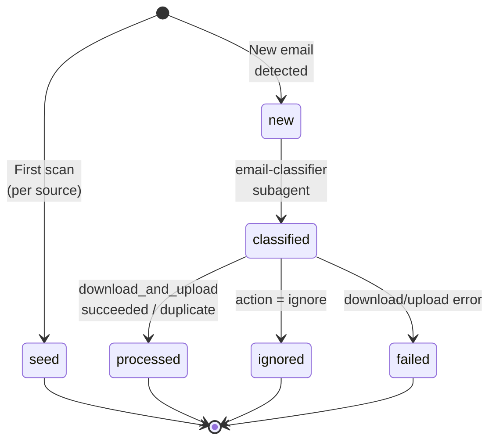

# UC-1: Invoice Processing (email → Paperless)

Automated pipeline: poll Gmail + Outlook → classify with Haiku → process via durable workflow → upload to Paperless-ngx → notify via Telegram.

## Architecture

### Container Boundaries

### Pipeline Flow

```mermaid
sequenceDiagram
    participant G as Gmail/Outlook MCPs
    participant EW as email-watcher<br/>(channel)
    participant DB as SQLite
    participant C as Claude (Sonnet)
    participant CL as email-classifier<br/>(Haiku)
    participant WF as workflow-mcp
    participant IW as invoice-worker
    participant P as Paperless MCP
    participant TG as Telegram

    rect rgb(40, 40, 60)
    note over G,TG: First scan (per source)
    G-->>EW: emails[]
    EW->>DB: INSERT status="seed" (all emails)
    note over DB: Seeds are terminal — never processed
    end

    rect rgb(40, 40, 60)
    note over G,TG: Subsequent polls — new email detected
    loop Every 30s
        EW->>G: poll
        G-->>EW: emails[]
    end
    EW->>DB: emailExists(id)?
    DB-->>EW: false
    EW->>DB: INSERT status="new"
    EW--)C: channel notification<br/>(sender, subject, message_id, source)
    end

    rect rgb(50, 40, 40)
    note over C,CL: Step 1 — Classify
    C->>CL: dispatch (email metadata)
    CL-->>C: JSON {is_invoice, confidence,<br/>vendor, action, doc_type}
    C->>EW: update_email_status(id,<br/>status="classified",<br/>classification, action,<br/>vendor, confidence)
    EW->>DB: UPDATE classified_at=now()
    end

    rect rgb(40, 50, 40)
    note over C,TG: Step 2 — Act on classification

    alt action = "download_and_upload"
        C->>WF: create_invoice_intake_job
        WF->>IW: execute job
        IW->>G: download attachment/link
        G-->>IW: base64 file
        IW->>P: search (dedup check)
        P-->>IW: no duplicate
        IW->>P: post_document
        P-->>IW: document ID
        IW-->>WF: completed

        alt "Uploaded ..."
            C->>TG: reply("Uploaded {vendor} invoice")
        else "DUPLICATE: ..."
            note over C: Skip silently (no notification)
        else "DUPLICATE_LIKELY: ..."
            C->>TG: reply("Ask user: proceed?")
        else "FAILED: ..."
            C->>TG: reply("{vendor} failed: {reason}")
        end

    else action = "notify_user"
        C->>TG: reply("New invoice from {sender}.<br/>Process? Reply yes/no")

    else action = "ignore"
        note over C: Silent — no notification
    end
    end

    rect rgb(40, 40, 50)
    note over C,DB: Step 3 — Record final status
    C->>EW: update_email_status(id,<br/>status="processed|failed|ignored",<br/>process_result="...")
    EW->>DB: UPDATE processed_at=now()
    end
```

## UC-1.1: Gmail Polling

Polls Gmail via the community `google_workspace_mcp` image (pinned `1.14.3`).

**Flow:** `search_gmail_messages` → extract IDs → `get_gmail_messages_content_batch` → parse metadata.

**Code:**
- [`email-watcher.ts:498-560`](../local/claude-code/channels/email-watcher.ts#L498) — `pollGmail()`: search + batch-fetch + parse
- [`email-watcher.ts:508-512`](../local/claude-code/channels/email-watcher.ts#L508) — search query from `GMAIL_SEARCH_QUERY` env (default: `newer_than:1d`)

**Auth:** OAuth via `https://gmail-mcp.lacny.me/oauth2callback`. Trigger `start_google_auth` tool from inside the Claude session. Tokens persist in `/mnt/shared_configs/personal-assistant/gmail/`.

**Config:**
- [`docker-compose.yml:96-128`](../docker-compose.yml#L96) — gmail-mcp service (community image, caddy label for OAuth callback, env vars)

## UC-1.2: Outlook Polling

Polls Outlook via custom MCP server using Microsoft Graph API.

**Flow:** `list_emails(top=20)` → parse response array → map to `EmailInfo`.

**Code:**
- [`email-watcher.ts:566-597`](../local/claude-code/channels/email-watcher.ts#L566) — `pollOutlook()`: call `list_emails`, parse array
- [`outlook-mcp/server.py`](../local/outlook-mcp/server.py) — 6 tools: `list_emails`, `get_email`, `get_attachments`, `download_attachment`, `extract_invoice_links`, `download_invoice_link`
- [`outlook-mcp/server.py:22-26`](../local/outlook-mcp/server.py#L22) — `INVOICE_RULES`: regex patterns for invoice link extraction (e.g., Alza.sk "Stiahnuť faktúru")

**Auth:** MSAL device code flow. On first start (no cached token), prints URL + code in container logs. Tokens persist in `/mnt/shared_configs/personal-assistant/outlook/token_cache.json`.

**Config:**
- [`docker-compose.yml:129-149`](../docker-compose.yml#L129) — outlook-mcp service (MSAL env vars, stateless HTTP, NAS volume)

## UC-1.3: Classification

Haiku subagent classifies each new email by sender, subject, and body excerpt.

**Output fields:** `is_invoice`, `confidence` (high/medium/low), `vendor`, `doc_type`, `is_fuel`, `suggested_tags`, `action` (download_and_upload/notify_user/ignore), `download_strategy` (attachment/known_link/direct_url/browser_required/manual_review), `strategy_confidence`, `requires_review`, `order_id`, `total_amount`, `currency`.

**Code:**
- [`agents/email-classifier.md`](../local/claude-code/agents/email-classifier.md) — Haiku classifier prompt defining all output fields and decision rules
- [`invoice-worker.ts:33-89`](../local/claude-code/channels/invoice-worker.ts#L33) — `InvoiceIntakeInput` type definition with all classification fields

**Status recording:** After classification, Claude calls `update_email_status` with the classification JSON, action, vendor, and confidence.

## UC-1.4: Upload to Paperless

The invoice-worker uploads documents via the Paperless MCP's `post_document` tool.

**Steps:**
1. **Resolve correspondent** — match vendor name to existing Paperless correspondent (case-insensitive), create if missing
2. **Resolve tags** — map `suggested_tags` to Paperless tag IDs, create missing tags
3. **Resolve document type** — map `doc_type` to Paperless type (invoice → "invoice", statement → "account_statement")
4. **Build title** — `{vendor} - {order_id}` or `{vendor} - {subject}`
5. **Upload** — `post_document` with base64 content, correspondent, tags, type, custom fields (total_amount, order_id)

**Code:**
- [`invoice-worker.ts:422-448`](../local/claude-code/channels/invoice-worker.ts#L422) — `resolveCorrespondent()`: list → match → create if needed
- [`invoice-worker.ts:456-512`](../local/claude-code/channels/invoice-worker.ts#L456) — `checkDuplicate()`: search by order_id + correspondent, compare amounts
- [`invoice-worker.ts:514-540`](../local/claude-code/channels/invoice-worker.ts#L514) — `resolveTags()`: list → match → create missing
- [`invoice-worker.ts:587-630`](../local/claude-code/channels/invoice-worker.ts#L587) — `uploadToPaperless()`: assemble args, call `post_document`
- [`invoice-worker.ts:634-651`](../local/claude-code/channels/invoice-worker.ts#L634) — `buildTitle()`: title generation logic

## UC-1.5: Telegram Notification

Claude notifies the user via the Telegram channel's `reply` tool after processing.

**Notification types:**
- Success: `"✓ Uploaded {vendor} invoice to Paperless ({amount} EUR)"`
- Failure: `"⚠ {vendor} invoice download failed: {reason}"`
- Unknown vendor: `"New invoice from {sender}: {subject}. Process? Reply yes/no"`
- Auth expired: `"⚠ {service} auth expired — re-authenticate"`

**Channel notifications (email-watcher → Claude):**
- [`email-watcher.ts:676-702`](../local/claude-code/channels/email-watcher.ts#L676) — channel notification format: meta fields include `email_source`, `message_id`, `sender`, `subject`, `has_attachments`, `received_at`

**Telegram plugin:** Official Anthropic plugin, cloned at Docker build time from `github.com/anthropics/claude-plugins-official`.
- [`Dockerfile:33-36`](../local/claude-code/Dockerfile#L33) — git clone + bun install

## UC-1.6: Approval Gates

The invoice-worker pauses automatically for edge cases and waits for human approval via Telegram.

**Approval triggers:**
1. `download_strategy === "browser_required" || "manual_review"` — can't auto-download
2. `vendor === "unknown"` — classifier couldn't identify sender
3. `confidence === "low"` — low classification confidence
4. `requires_review === true` — classifier flagged for review
5. Dedup: amount mismatch on matching order_id (`duplicate_likely`)

**Code:**
- [`invoice-worker.ts:107-148`](../local/claude-code/channels/invoice-worker.ts#L107) — four approval gates (strategy, unknown vendor, low confidence, requires_review)
- [`invoice-worker.ts:189-195`](../local/claude-code/channels/invoice-worker.ts#L189) — `duplicate_likely` approval gate

**Workflow tools for approval:**
- [`workflow-mcp.ts:150-161`](../local/claude-code/channels/workflow-mcp.ts#L150) — `approve_job` tool definition
- [`workflow-mcp.ts:163-174`](../local/claude-code/channels/workflow-mcp.ts#L163) — `cancel_job` tool definition

**Status:** Approval gates implemented and tested (19 unit tests). Deployed.

## UC-1.7: Query Invoice Status

Claude can query Paperless directly using `search_documents` from the community Paperless MCP. Example: "do I have March invoices?" triggers a search with month filter.

**Also available:** email-watcher audit trail queries:
- [`email-watcher.ts:759-769`](../local/claude-code/channels/email-watcher.ts#L759) — `get_recent_emails` tool (filter by status, source, limit)
- [`email-watcher.ts:771-777`](../local/claude-code/channels/email-watcher.ts#L771) — `get_email_stats` tool (counts by status, last 24h breakdown)

## Download Strategies

The classifier assigns a `download_strategy` that determines how the worker gets the file:

| Strategy | Handler | Description |
|----------|---------|-------------|
| `attachment` | [`invoice-worker.ts:270-369`](../local/claude-code/channels/invoice-worker.ts#L270) | Download email attachment via MCP (prefers PDF) |
| `known_link` | [`invoice-worker.ts:371-413`](../local/claude-code/channels/invoice-worker.ts#L371) | Extract invoice link from email body using vendor rules, download via MCP |
| `direct_url` | Same as known_link | Direct URL in email body |
| `browser_required` | Pauses for approval | Requires browser interaction (e.g., login-gated portal) |
| `manual_review` | Pauses for approval | Classifier unsure, needs human review |

**Outlook vendor rules** for link extraction: [`outlook-mcp/server.py:22-26`](../local/outlook-mcp/server.py#L22) — regex patterns matching sender + link text + subject (e.g., Alza.sk).

## Durable Workflow Layer

Jobs survive container restarts. The workflow layer provides:

- **SQLite-backed job queue** with states: `queued → running → completed/failed/awaiting_approval`
- **Event log** per job tracking every step (download, dedup, upload)
- **Idempotency keys** to prevent duplicate job creation
- **Worker polling** every 2s for queued jobs

**Code:**
- [`workflow-db.ts:46-78`](../local/claude-code/channels/workflow-db.ts#L46) — schema: `jobs` + `job_events` tables
- [`workflow-core.ts:55-89`](../local/claude-code/channels/workflow-core.ts#L55) — `executeNextJob()`: claim + dispatch by workflow_type
- [`workflow-mcp.ts:39-47`](../local/claude-code/channels/workflow-mcp.ts#L39) — worker loop: poll every `WORKFLOW_POLL_MS` (default 2s)
- [`workflow-mcp.ts:60-176`](../local/claude-code/channels/workflow-mcp.ts#L60) — 7 MCP tools exposed to Claude
- [`mcp-client.ts:32-75`](../local/claude-code/channels/mcp-client.ts#L32) — HTTP MCP client for worker → MCP server calls (stateless path)
- [`mcp-client.ts:81-170`](../local/claude-code/channels/mcp-client.ts#L81) — stateful MCP client with initialize handshake (for paperless-mcp, gmail-mcp)

## Email Audit Trail

Every email is tracked in SQLite from discovery to final outcome.

**Schema:** [`db.ts:47-66`](../local/claude-code/channels/db.ts#L47) — `emails` table with fields: id, source, sender, subject, preview, has_attachments, received_at, discovered_at, classified_at, classification, action, vendor, confidence, processed_at, process_result, status.

### Status Lifecycle

### Status Reference

| Status | Meaning | Set by | Timestamp |
|--------|---------|--------|-----------|
| `seed` | Pre-existing email from first scan — never processed | email-watcher `pollCycle` | `discovered_at` |
| `new` | Newly detected, pushed to Claude as channel event | email-watcher `pollCycle` | `discovered_at` |
| `classified` | email-classifier returned classification JSON | Claude via `update_email_status` | `classified_at` (auto) |
| `processed` | invoice-worker completed (uploaded or duplicate) | Claude via `update_email_status` | `processed_at` (auto) |
| `ignored` | Classifier said action=ignore (not an invoice) | Claude via `update_email_status` | `processed_at` |
| `failed` | Download, upload, or classification error | Claude via `update_email_status` | `processed_at` |

### Design Decisions

- **Per-source seeding**: Gmail and Outlook seed independently via `hasAnyEmailsForSource()` — prevents false "new" notifications when one source seeds before the other
- **Capping**: Max 5 new emails per poll cycle (`MAX_NEW_PER_CYCLE`) to avoid flooding Claude's context
- **Two-stage update**: Classification and processing are separate `update_email_status` calls — shows where in the pipeline an email stalled
- **Auto-timestamps**: `classified_at` set when `classification` provided, `processed_at` when `process_result` provided
- **Idempotent inserts**: `INSERT OR IGNORE` on email ID prevents duplicate pushes across restarts

**First-run seeding:** On startup, if no emails exist for a source, existing emails are inserted as `seed` status without triggering notifications. Only subsequent new emails generate channel events.
- [`email-watcher.ts:603-704`](../local/claude-code/channels/email-watcher.ts#L603) — `pollCycle()`: seed detection, dedup, notification push
