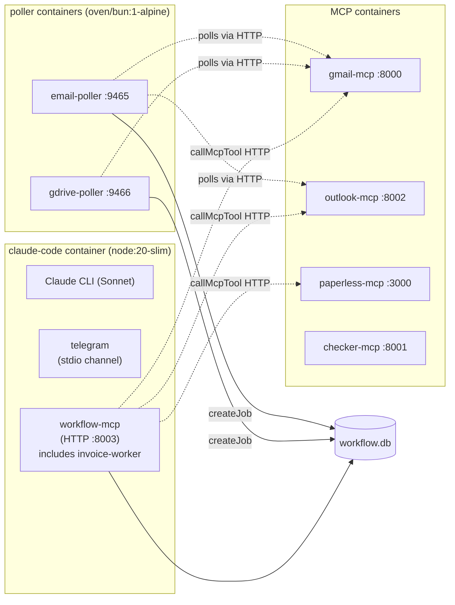
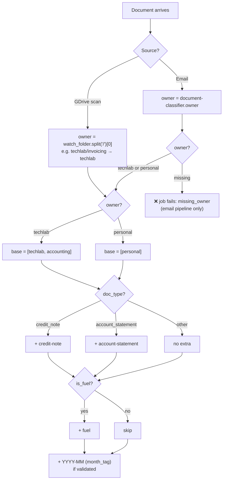
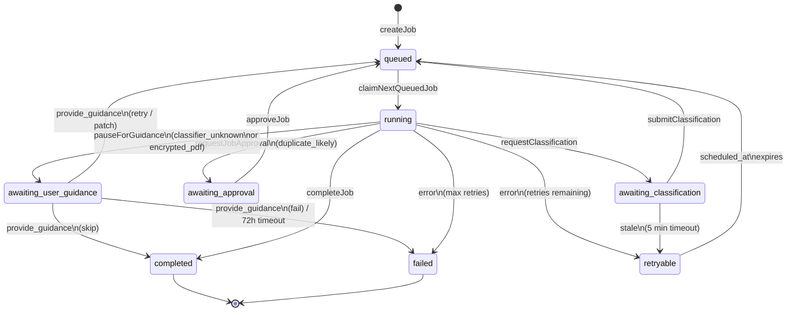
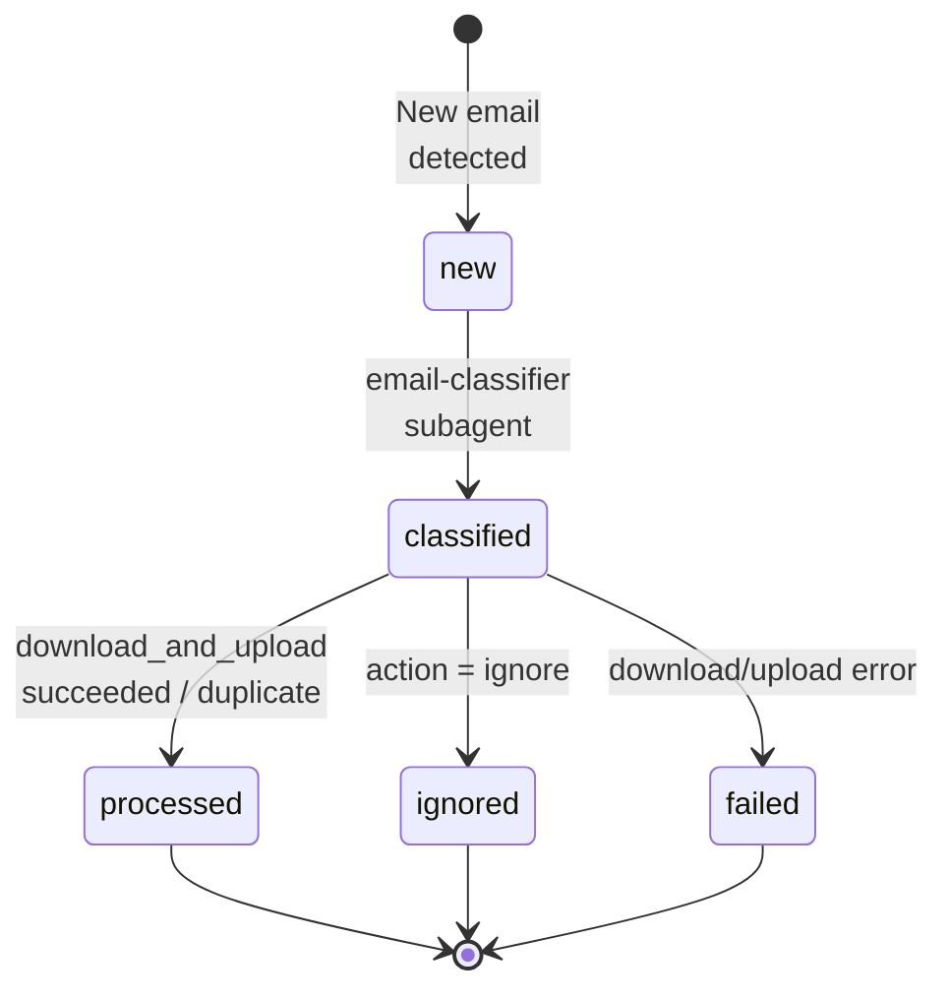
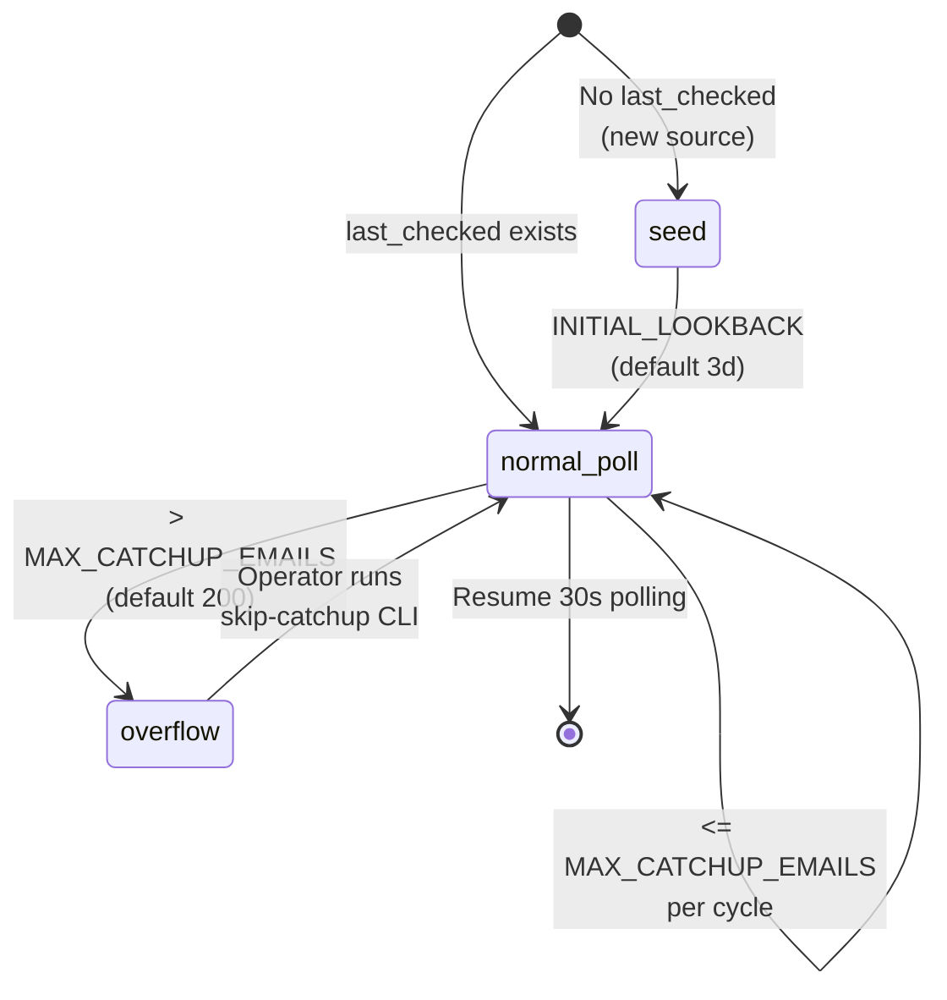

# UC-1: Invoice Processing (email → Paperless)

Automated pipeline: poll Gmail + Outlook → classify email with Haiku → download PDF → classify document with Haiku → process via durable workflow → upload to Paperless-ngx → notify via Telegram.

## Architecture

### Container Boundaries



### Pipeline Flow

```mermaid
sequenceDiagram
    participant G as Gmail/Outlook MCPs
    participant EP as email-poller<br/>(standalone container)
    participant DB as SQLite
    participant C as Claude (Sonnet)
    participant CL as email-classifier<br/>(Haiku)
    participant DC as document-classifier<br/>(Haiku)
    participant WF as workflow-mcp
    participant IW as invoice-worker
    participant P as Paperless MCP
    participant TG as Telegram

    rect rgb(40, 40, 60)
    note over G,TG: First run — no last_checked for source
    EP->>DB: getLastChecked(source)?
    DB-->>EP: null
    note over EP: Seed last_checked from INITIAL_LOOKBACK (default 3d).<br/>No Telegram prompt — fully automatic.
    EP->>DB: INSERT source_state(last_checked = now - INITIAL_LOOKBACK)
    end

    rect rgb(40, 40, 60)
    note over G,TG: Normal poll — new email detected
    loop Every 30s
        EP->>G: poll (since last_checked)
        G-->>EP: emails[]
    end
    EP->>DB: emailExists(id)?
    DB-->>EP: false
    EP->>DB: INSERT email (audit trail)
    EP->>DB: createJob(workflow.db)<br/>invoice_intake job
    note over EP: No channel notification —<br/>Claude not in job creation path
    EP->>DB: setLastChecked(source, now)
    end

    rect rgb(50, 40, 40)
    note over IW,TG: Worker-driven pipeline (3 ticks)

    note over IW,C: Tick 1 — Email classification
    IW->>IW: claimNextQueuedJob
    IW--)C: channel event (classify_email)
    C->>CL: dispatch email-classifier (Haiku)
    CL-->>C: JSON {vendor, action, download_strategy, ...}
    C->>WF: submit_classification(job_id, "classify_email", result)

    note over IW,C: Tick 2 — Download + document classification
    IW->>IW: resume job, download PDF
    IW--)C: channel event (classify_document)
    C->>DC: dispatch document-classifier (Haiku)
    DC-->>C: JSON {vendor, total_amount, doc_type, owner, ...}
    C->>WF: submit_classification(job_id, "classify_document", result)

    note over IW,P: Tick 3 — Upload
    IW->>IW: merge classifications, resolve tags
    IW->>P: dedup check (order_id + correspondent)

    alt exact duplicate (same amount)
        IW-->>WF: completed (outcome: duplicate)
        note over IW: Skip silently (no notification)
    else duplicate_likely (amount mismatch)
        IW-->>WF: awaiting_approval
        C->>TG: reply("Possible duplicate, approve?")
    else no duplicate
        IW->>P: POST /api/documents/post_document/ (direct HTTP) + custom fields PATCH
        IW-->>WF: completed (outcome: uploaded)
        IW->>TG: notifyTelegram("✔️ {vendor} | {amount} EUR | ...")
        note over WF: completeJob() automatically calls cleanupJobFiles()<br/>which deletes any file_downloaded events for this job
    end

    alt action = "ignore"
        note over IW: Job completed (outcome: ignored)
    end
    end
```



> **Note on email status recording.** The pipeline does NOT call any
> `update_email_status` tool — that function does not exist. The email audit
> trail in `emails.db` is insert-only. Job lifecycle (queued → running →
> completed/failed/cancelled) lives entirely in `workflow.db` (`jobs` +
> `job_events` tables). Anywhere in this doc that previously referenced
> `update_email_status` was wrong; the source of truth for processing state
> is the workflow ledger.

## UC-1.1: Gmail Polling

Polls Gmail via the community `google_workspace_mcp` image (pinned `1.16.2`, supports `body_format: "html"`).

**Flow:** `search_gmail_messages` (page_size=50) → extract IDs (deduplicated via `Set`) → `get_gmail_messages_content_batch` → parse metadata.

`parseGmailEmails` checks whether search results contain actual metadata (Subject/From/To headers). Gmail search often returns sparse results with only Message IDs and no headers — when this happens, `parseGmailEmails` falls through to the batch-fetch path instead of short-circuiting with incomplete data.

`extractGmailIds` deduplicates IDs with `new Set()` because Gmail search results can return the same message as Message ID, Thread ID, and URL hex — without dedup, batch-fetch would process the same email multiple times.

**Code:**
- [`pollers/email-poller/src/main.ts`](../pollers/email-poller/src/main.ts) — `pollGmail()`: search + batch-fetch + parse
- `GMAIL_SEARCH_BASE` env (default: `newer_than:1d`) — search query base

**Auth:** Trigger `start_google_auth` from inside the Claude session. The `gmail-mcp-auth` Caddy sidecar passes the OAuth callback through while protecting the MCP endpoint with a bearer token. Tokens persist in `/mnt/shared_configs/<stack>/gmail/` or your configured persistent volume.

**Config:**
- [`docker-compose.yml:128-160`](../docker-compose.yml#L128) — gmail-mcp service (community image, Docker-internal only)
- [`docker-compose.yml:162-184`](../docker-compose.yml#L162) — gmail-mcp-auth sidecar (bearer token on /mcp, pass-through on /oauth2callback)

## UC-1.2: Outlook Polling

Polls Outlook via custom MCP server using Microsoft Graph API.

**Flow:** `list_emails(top=20)` → parse response array → map to `EmailInfo`.

**Code:**
- [`pollers/email-poller/src/main.ts`](../pollers/email-poller/src/main.ts) — `pollOutlook()`: call `list_emails`, parse array
- [`outlook-mcp/server.py`](../outlook-mcp/server.py) — 4 tools: `list_emails`, `get_email`, `get_attachments`, `download_attachment`

**Auth:** MSAL device-code flow. On first start (no cached token), the container prints a URL and code in logs. Tokens persist in `/mnt/shared_configs/<stack>/outlook/token_cache.json` or your configured persistent volume.

**Config:**
- [`docker-compose.yml:129-149`](../docker-compose.yml#L129) — outlook-mcp service (MSAL env vars, stateless HTTP, NAS volume)

## UC-1.3: Classification

Haiku subagent fetches the email body itself via the gmail/outlook MCP and classifies it. The parent Claude session never reads the body — it just dispatches the subagent with `{email_source, message_id, user_google_email?}` from the workflow channel meta. Keeping the body inside the throwaway subagent context prevents the parent session from accumulating email bodies across classifications.

**Output fields:** `is_invoice`, `confidence` (high/medium/low), `vendor`, `is_fuel`, `action` (download_and_upload/notify_user/ignore), `download_strategy` (attachment/claude_download/known_link/direct_url/browser_required/manual_review), `strategy_confidence`, `requires_review`, `order_id`, `total_amount`, `currency`. Note: `doc_type` and `owner` are not returned by the email-classifier — these come exclusively from the document-classifier after PDF download.

**Download strategy rules:**
- `has_attachments` + single invoice expected → `attachment` (worker downloads automatically, picks first PDF — works for both Gmail and Outlook)
- `has_attachments` + multiple documents (e.g., order confirmation with packing slip + invoice + shipping label) → `claude_download` (Claude inspects attachments, picks the right one, downloads to disk, passes `file_path` to the job)
- Known vendor download link → `known_link`; direct PDF URL → `direct_url`; portal login required → `browser_required`

**Code:**
- [`agents/email-classifier.md`](../claude-code/agents/email-classifier.md) — Haiku classifier prompt defining all output fields and decision rules
- [`invoice-worker.ts:42-76`](../claude-code/channels/invoice-worker.ts#L42) — `InvoiceIntakeInput` type definition with all classification fields

**Document classification (post-download):** After downloading the PDF, Claude runs the `document-classifier` Haiku subagent ([`agents/document-classifier.md`](../claude-code/agents/document-classifier.md)) which visually inspects the PDF and returns 9 fields: `doc_type`, `vendor`, `total_amount`, `currency`, `is_fuel`, `confidence`, `order_id`, `subtitle`, `owner`. Non-null values override the email-classifier's guesses. `doc_type`, `subtitle`, and `owner` come exclusively from this classifier. This same classifier handles GDrive scans.

**Status recording:** Classification results are stored as `step_completed` events on the workflow job (in `workflow.db`), not as a status column on the email row. The email DB is insert-only audit data; the workflow DB is the processing source of truth. `submitClassification(job_id, step, result)` validates the result against the schema in `workflow-schemas.ts` and either fails the job with `schema_validation_failed` (on bad input) or persists it for the worker resume path.

## UC-1.4: Upload to Paperless

The invoice-worker uploads documents directly to the Paperless HTTP API, **not** via the Paperless MCP. The MCP's `post_document` tool buffers the entire file in memory and breaks for documents larger than ~5 MB; direct HTTP POST to `/api/documents/post_document/` streams the multipart upload safely.

**Steps:**
1. **Resolve correspondent** — match vendor name to existing Paperless correspondent (case-insensitive + Jaro-Winkler 0.85), create if missing (Paperless MCP `list_correspondents` / `create_correspondent`)
2. **Resolve tags** — derive tags from the `owner` field set by the document-classifier (see owner-aware logic below), create missing tags (Paperless MCP `list_tags` / `create_tag`)
3. **Resolve document type** — map `doc_type` to Paperless type (invoice → "Invoice", receipt → "Invoice", credit_note → "Invoice", account_statement → "Document", document → "Document", payslip → "Document") (Paperless MCP `list_document_types`)
4. **Build title** — priority: `{vendor} - {order_id}` → `{vendor} - {subtitle}` → `{vendor} - {subject/filename}` → `{vendor} - invoice/scan`
5. **Upload** — direct HTTP `POST /api/documents/post_document/` with base64-decoded multipart body, correspondent, tags, type. Returns a `task_uuid`.
6. **Custom fields** — poll `GET /api/tasks/?task_id={uuid}` until consumption succeeds and a doc id is known, then `PATCH /api/documents/{doc_id}/` with custom fields (total_amount, order_id)

**Tag derivation (unified):**

Tags are derived deterministically by `buildTagNames()` in `invoice-pipeline.ts:185`. Both pipelines (email and GDrive scan) call the same function — there is **no separate per-source tag logic**. The only difference is where `owner` comes from:

- **Email pipeline** — raw `owner` comes from the document-classifier (`techlab` or `personal`). The classifier inspects the PDF for business identifiers, which is *inference* and can misfire (e.g., a payslip from your own company always has the employer header + IČO and would otherwise be tagged `techlab`). The raw value is then passed through `resolveOwner(rawOwner, docType)` in the same file, which applies one doc_type-aware rule: `doc_type === "payslip" → owner = "personal"`. `resolveOwner` is called once before both `buildTagNames` and `resolveStoragePathId`, so tags and storage path always agree. If the classifier is missing an `owner` field, the email job still fails fast with `missing_owner`.
- **GDrive scan pipeline** — `owner` comes from the watch folder's first segment (`watch_folder.split("/")[0]`). For `watch_folder=techlab/invoicing` the owner is `techlab`. The classifier's `owner` field is ignored on this path because the operator's folder choice is authoritative.

**Payslips (email path only):** `doc_type=payslip` from the email path forces owner to `personal` via `resolveOwner`, so the final tags are `[personal, YYYY-MM]` — no `accounting`, no `techlab`, even if the classifier's raw owner field said `techlab`. This keeps payslips out of the `checker-mcp` matching pipeline (which filters on `accounting`). A payslip scanned via GDrive is NOT overridden — folder choice wins.

Both then go through the same `buildTagNames(...)` rules:

| Owner | Always | If `doc_type=credit_note` | If `doc_type=account_statement` | If `is_fuel` | Plus |
|-------|--------|---------------------------|---------------------------------|--------------|------|
| techlab | `techlab`, `accounting` | + `credit-note` | + `account-statement` | + `fuel` | + `YYYY-MM` (if validated) |
| personal | `personal` | + `credit-note` | + `account-statement` | + `fuel` | + `YYYY-MM` (if validated) |

Example: `watch_folder=techlab/invoicing` + invoice + April → `[techlab, accounting, 2026-04]`. Note the second tag is `accounting`, **not** `invoicing` — `invoicing` is a folder path segment, not a Paperless tag.



**`month_tag` source** is unified across both pipelines: the document-classifier returns a reasoned `accounting_period` that wins over all other signals (see `month_tag resolution` section below). Deterministic date inference (`supply_date`, `service_period`, `doc_date`, hardened subject regex, `received_at`, GDrive scan date) acts only as a safety-net chain when the LLM didn't decide.

**Code:**
- [`paperless-adapter.ts`](../claude-code/channels/paperless-adapter.ts) — unified Paperless boundary (MCP + direct HTTP). All Paperless interactions in the worker route through this module.
- [`paperless-adapter.ts:findCorrespondent / createCorrespondent`](../claude-code/channels/paperless-adapter.ts) — fuzzy match (Jaro-Winkler 0.85 via `fuzzy-match.ts`) then create if missing.
- [`paperless-adapter.ts:searchDocumentsByCustomFieldAndCorrespondent`](../claude-code/channels/paperless-adapter.ts) — dedup search by order_id + correspondent.
- [`paperless-adapter.ts:resolveTagIds / findDocumentTypeId / findStoragePathId`](../claude-code/channels/paperless-adapter.ts) — list-and-match against MCP / REST API.
- [`paperless-adapter.ts:uploadDocument`](../claude-code/channels/paperless-adapter.ts) — direct HTTP multipart POST (bypasses paperless-mcp).
- [`paperless-adapter.ts:patchDocument`](../claude-code/channels/paperless-adapter.ts) — force-refresh path (PATCH existing doc in place).
- [`paperless-adapter.ts:waitForConsumption / setCustomFields`](../claude-code/channels/paperless-adapter.ts) — task polling + custom field PATCH after consumption.
- [`invoice-worker.ts:executeInvoiceIntake`](../claude-code/channels/invoice-worker.ts) — orchestrates the steps; calls into the adapter for every Paperless operation.
- [`invoice-pipeline.ts:buildTagNames / generateTitle`](../claude-code/channels/invoice-pipeline.ts) — pure pipeline functions (tag derivation rules table above; title priority order_id → subtitle → cleaned subject → fallback).

## UC-1.5: Telegram Notification

Notifications are split between the invoice-worker (automatic) and Claude (interactive).

**Worker notifications (automatic, fire-and-forget):**

The invoice-worker sends structured one-liner notifications via Telegram Bot API after each job completion:

| Outcome | Format | Example |
|---------|--------|---------|
| `uploaded` | `✔️  {vendor} \| {amount} {currency} \| {doc_type} \| {owner} \| {month_tag}` | `✔️  Slovak Telekom \| 42.99 EUR \| invoice \| techlab \| 2026-04` |
| `refreshed` | `🔄  {vendor} \| {amount} {currency} \| {doc_type} \| {owner} \| {month_tag} (refreshed #N)` | `🔄  Anthropic, PBC \| 100 EUR \| invoice \| techlab \| 2026-04 (refreshed #411)` |
| `failed` | `❌  {vendor} \| {amount} {currency} \| {doc_type} \| {owner} \| {error}` | `❌  Orange \| ? EUR \| invoice \| techlab \| download failed: 404` |
| `duplicate` | *(silent — no notification)* | |

Missing fields show `?` placeholder; missing `month_tag` shows `no-period` (tells the operator to tag manually). Currency defaults to `EUR` when null. The `refreshed` outcome is produced by force-reprocess jobs that PATCH an existing Paperless document instead of uploading a new one — see "Force reprocess" below.

**Code:**
- [`telegram-notify.ts`](../claude-code/channels/telegram-notify.ts) — `formatNotification()` pure function + `NotifyFn` type
- [`workflow-mcp.ts:31-44`](../claude-code/channels/workflow-mcp.ts#L31) — `notifyTelegram` callback (Telegram Bot API via fetch)
- Callback threaded: `workflow-mcp.ts` → `workflow-core.ts` → `invoice-worker.ts`

**Claude notifications (interactive):**

Claude still handles notifications that require user interaction:
- `awaiting_approval` jobs → ask user via Telegram, wait for response
- `notify_user` classification → ask user what to do
- Auth expired → alert user to re-authenticate

**Poller notifications:** The email-poller and gdrive-poller services do not send channel notifications at all — they run in their own containers and create workflow jobs directly in `workflow.db`. Claude receives channel events only from `workflow-mcp` (classification requests, approval prompts). The previous `first_start` / `catchup_required` channel events were removed; first-run seeding is now handled by `INITIAL_LOOKBACK` and over-cap windows by the fail-loud `email_watcher.catchup_overflow` counter.

**Telegram plugin:** Official Anthropic plugin, cloned at Docker build time from `github.com/anthropics/claude-plugins-official`.
- [`Dockerfile:33-36`](../claude-code/Dockerfile#L33) — git clone + bun install

## UC-1.6: Approval Gates

The invoice-worker pauses automatically for edge cases and waits for human approval via Telegram.

**Approval triggers (post-Task 16 simplification):**
1. Dedup: amount mismatch on matching order_id (`duplicate_likely`)

Gates for unknown vendor, low confidence, browser_required, and requires_review were removed — triage now happens in Claude before job creation, using the document-classifier's higher-quality PDF analysis.

**Code:**
- [`invoice-worker.ts:234-244`](../claude-code/channels/invoice-worker.ts#L234) — `duplicate_likely` approval gate

**Workflow tools for approval:**
- [`workflow-mcp.ts:188-199`](../claude-code/channels/workflow-mcp.ts#L188) — `approve_job` tool definition
- [`workflow-mcp.ts:201-211`](../claude-code/channels/workflow-mcp.ts#L201) — `cancel_job` tool definition

**Status:** Simplified to single dedup gate. Deployed.

## UC-1.6b: When the classifier doesn't know (guidance pause)

The worker pauses a job in `awaiting_user_guidance` whenever it would otherwise have to guess or hallucinate. Two triggers:

- **Trigger A — classifier said `"unknown"`**. Both `email-classifier` and `document-classifier` are now allowed to return `"unknown"` for required fields (e.g. `owner`, `doc_type`, `total_amount`) and MUST populate `notes` explaining why. The worker detects any `"unknown"` in the merged classification and pauses with `reason: "classifier_unknown"` plus the list of missing fields.
- **Trigger B — PDF still encrypted after `tryDecrypt`**. Both intake paths call `download-helper.tryDecrypt` (wraps `qpdf` via `file-ops` MCP, uses `BANK_PDF_PASSWORD`) immediately after download. If the file is still encrypted afterwards the worker pauses with `reason: "encrypted_pdf"`. Previously only the GDrive scan path decrypted; the email path has also been wired up (closes the original bug where doc 422 — a password-protected mBank statement attached to an email — was pushed through the classifier with 0 extractable text and misfiled as a techlab invoice).

When the worker pauses, `pauseAndNotify` writes a `guidance_request` event carrying `step`, `reason`, `missing_fields`, `suggested_actions`, and `context` (filename, sender, subject, classifier notes), sets state to `awaiting_user_guidance`, and sends a Telegram message with an inline keyboard (`formatGuidanceRequest` + `buildGuidanceReplyMarkup` in `telegram-notify.ts`).

The user resumes the job with `provide_guidance(job_id, guidance)`:

| `guidance.action` | Effect |
|---|---|
| `skip` | Complete the job with `outcome: "skipped"`. |
| `fail` | Fail the job with `code: "user_cancelled"`. |
| `retry` | Re-queue and re-run the paused step as-is. |
| `patch` | Re-queue; worker merges `guidance.patch` into the classification on resume. |

`decrypt_password` (for Trigger B) is written to a separate `guidance_password` job event so password material never lands in the normal `guidance_applied` audit row — the `guidance_applied` event only records `decrypt_password_provided: boolean`.

Routing of free-form Telegram replies into `provide_guidance` calls happens in the Claude session; see `claude-code/CLAUDE.md` section "Guidance routing for paused jobs" for the stack-discipline rule (if exactly one job is paused, the next non-command Telegram message targets it) and for the slash-command / NL parsing rules.

**Stale guidance sweep.** `sweepStaleGuidance` runs on a 60s `setInterval`: at 24h it nudges the operator with a Telegram reminder, at 72h it auto-fails the job with `code: "timed_out"`. The 24h reminder is rate-limited per job — once a nudge fires, `last_reminder_at` is stamped and the same job won't be re-notified for at least `GUIDANCE_REMINDER_COOLDOWN_HOURS` (6h). Without this cooldown the 60s tick spammed Telegram every minute as soon as any job crossed the 24h threshold. Tunables: `GUIDANCE_REMINDER_HOURS`, `GUIDANCE_TIMEOUT_HOURS`, `GUIDANCE_REMINDER_COOLDOWN_HOURS` in `workflow-mcp.ts`.

**Observability.** `personal_assistant_guidance_requests_total{reason}` counter, Loki events `guidance.requested` / `guidance.received` / `guidance.applied`, and a stacked-bar Grafana panel (id 41) track the pause volume by reason.

**Code:**
- [`workflow-db.ts:387-423`](../claude-code/channels/workflow-db.ts#L387) — `GuidanceRequestPayload` type + `pauseForGuidance` helper
- [`workflow-mcp.ts:85-187`](../claude-code/channels/workflow-mcp.ts#L85) — `Guidance` type + `handleProvideGuidance` (and the `provide_guidance` MCP tool registration further down)
- [`workflow-mcp.ts:223-275`](../claude-code/channels/workflow-mcp.ts#L223) — `sweepStaleGuidance` (72h auto-cancel + 24h reminder, 6h per-job cooldown)
- [`invoice/intake-worker.ts:387-616`](../claude-code/channels/invoice/intake-worker.ts#L387) — `pauseAndNotify` + Trigger A / B call sites (both intake paths)
- [`telegram-notify.ts`](../claude-code/channels/telegram-notify.ts) — `formatGuidanceRequest` + `buildGuidanceReplyMarkup`
- [`claude-code/CLAUDE.md`](../claude-code/CLAUDE.md) — "Guidance routing for paused jobs" (stack-discipline + slash commands + free-form parsing)

## UC-1.7: Query Invoice Status

Claude can query Paperless directly using `search_documents` from the community Paperless MCP. Example: "do I have March invoices?" triggers a search with month filter.

**Also available:** email-poller audit trail queries via `workflow-mcp` (read-only handles into `emails.db` / `gdrive.db`):
- `get_recent_emails(limit?, source?)` — recent rows from email-poller's audit log
- `get_email_stats()` — total + last-24h counts
- `get_gdrive_scan_status(limit?)` — recent rows from gdrive-poller's audit log
- `get_gdrive_scan_stats()` — total file count

Implementations: [`workflow-mcp.ts`](../claude-code/channels/workflow-mcp.ts) (search for `handleGetRecentEmails`).

## UC-1.8: GDrive Scan Auto-Upload

Scanned documents dropped into Google Drive are automatically classified and uploaded to Paperless.

**Pipeline:** gdrive-poller (standalone container) polls multiple level2 folders under a level1 parent → creates `scan_intake` job directly in workflow.db with `file_id`, `month_tag`, and `watch_folder` → worker downloads from GDrive, requests document classification via channel → uploads to Paperless with tags derived from the folder path, moves file to `processed/`.

### Scan Pipeline Flow

```mermaid
sequenceDiagram
    participant GD as Google Drive
    participant GW as gdrive-poller<br/>(standalone container)
    participant DB as SQLite
    participant IW as invoice-worker
    participant C as Claude (Sonnet)
    participant DC as document-classifier<br/>(Haiku)
    participant P as Paperless MCP
    participant TG as Telegram

    rect rgb(40, 40, 60)
    note over GD,TG: File detection
    loop Every 30s
        GW->>GD: list_drive_items (per watch folder)
        GD-->>GW: files[]
    end
    GW->>DB: fileExists(id)?
    DB-->>GW: false
    GW->>DB: INSERT file (status="new")
    GW->>DB: createJob(workflow.db)<br/>scan_intake job<br/>{file_id, watch_folder, month_tag}
    note over GW: month_tag = file created_time<br/>(last-resort fallback only)
    end

    rect rgb(50, 40, 40)
    note over IW,TG: Worker-driven pipeline (2 ticks)

    note over IW,C: Tick 1 — Download + document classification
    IW->>IW: claimNextQueuedJob
    IW->>GD: download file (via gmail MCP)
    IW->>IW: save to /workspace/downloads/
    IW--)C: channel event (classify_document)
    C->>DC: dispatch document-classifier (Haiku)
    DC-->>C: JSON {vendor, total_amount, doc_type, owner,<br/>doc_date, supply_date, service_period,<br/>accounting_period, accounting_period_reasoning, ...}
    C->>IW: submit_classification(job_id, "classify_document", result)

    note over IW,P: Tick 2 — Upload + move
    IW->>IW: resume job, read classification
    IW->>IW: resolveMonthTag:<br/>accounting_period (LLM) → supply_date →<br/>service_period → doc_date → scan date fallback
    IW->>P: resolve correspondent, tags, dedup
    IW->>P: post_document + custom fields
    IW->>GD: move file → processed/
    IW-->>DB: completed (outcome: uploaded)
    IW->>TG: notification
    end
```



Unlike the email path (3 ticks), scans need only 2 ticks — there is no email classification step. On failure, the worker moves the file to `errors/` instead of `processed/`.

**Multi-folder config:**
```env
GDRIVE_LEVEL1=techlab              # parent folder(s), comma-separated
GDRIVE_LEVEL2=invoicing,documents  # subfolders to watch, comma-separated
```

At startup, the watcher resolves every level1 × level2 combination (e.g. `techlab/invoicing`, `techlab/documents`). Both levels support comma-separated values, so `GDRIVE_LEVEL1=techlab,personal` with `GDRIVE_LEVEL2=invoicing,documents` would watch 4 folders. Each leaf folder gets `processed/` and `errors/` subfolders ensured. Files are polled from all folders every cycle. The `watch_folder` (e.g. `techlab/invoicing`) flows through the job input → worker, where it determines both tags and file move destination.

**Unified classifier:** Both email PDFs and GDrive scans use the same `document-classifier` agent. The email path adds an email-classifier triage step before download; the GDrive path skips it.

**PDF decryption:** Password-protected PDFs (e.g., bank statements) are decrypted via `file-ops` MCP `decrypt_pdf` tool (wraps qpdf). Password from `BANK_PDF_PASSWORD` env var. Both intake paths (email + scan) now call `download-helper.tryDecrypt` immediately after download; if decryption still fails afterwards, the worker pauses in `awaiting_user_guidance` (Trigger B — see UC-1.6b) instead of handing the encrypted PDF to the classifier.

**Code:**
- [`agents/document-classifier.md`](../claude-code/agents/document-classifier.md) — Haiku classifier prompt (7-field output)
- [`channels/file-ops.ts`](../claude-code/channels/file-ops.ts) — File-ops MCP tool server (download, delete, list, decrypt, base64, env)
- [`channels/download-helper.ts`](../claude-code/channels/download-helper.ts) — File utility functions (readFileAsDownload, tryDecrypt) used by file-ops + invoice-worker
- [`pollers/gdrive-poller/src/main.ts`](../pollers/gdrive-poller/src/main.ts) — GDrive polling service (multi-folder, standalone container)

## Download Strategies

The classifier assigns a `download_strategy` that determines how the worker gets the file:

| Strategy | Handler | Description |
|----------|---------|-------------|
| `attachment` | [`invoice-worker.ts:374-491`](../claude-code/channels/invoice-worker.ts#L374) | Download single email attachment via MCP (prefers PDF). Works for both Gmail (`get_gmail_message_content` + `get_gmail_attachment_content`) and Outlook (`get_attachments` + `download_attachment`). |
| `claude_download` | Claude pre-downloads | Multi-attachment emails — Claude inspects attachments, picks the invoice, downloads to disk, passes `file_path` to the job. Worker refuses to proceed without `file_path`. |
| `known_link` | [`invoice-worker.ts:493-535`](../claude-code/channels/invoice-worker.ts#L493) | Extract invoice link from email body using vendor rules, download via MCP |
| `direct_url` | Same as known_link | Direct URL in email body |
| `browser_required` | Pauses for approval | Requires browser interaction (e.g., login-gated portal) |
| `manual_review` | Pauses for approval | Classifier unsure, needs human review |

**Vendor rules** for link extraction: [`channels/invoice-links.ts`](../claude-code/channels/invoice-links.ts) — `INVOICE_LINK_RULES` is the single source of truth for vendor-specific patterns (sender + link text + subject). Used by both email-poller (Gmail HTML) and invoice-worker (Outlook `body_html`). The legacy `INVOICE_RULES` in `outlook-mcp/server.py` is superseded.

**Pre-job download (email path):** For `claude_download` and link strategies, Claude downloads the PDF *before* creating the intake job (using `file-ops` MCP `download_file` for links, email MCP tools for attachments). The job receives a `file_path` and the worker reads from disk. For `attachment` strategy, the worker downloads directly via MCP.

## Durable Workflow Layer

Jobs survive container restarts. The workflow layer provides:

- **SQLite-backed job queue** with durable state transitions
- **Event ledger** per job tracking every step (classification, download, dedup, upload)
- **Idempotency keys** to prevent duplicate job creation
- **Worker polling** every 2s for queued jobs
- **Stale job reclamation** on every tick (5-minute timeout)

### Job State Machine



The worker parks jobs in `awaiting_user_guidance` via `pauseForGuidance` when the classifier returns `"unknown"` on a required field (Trigger A) or the PDF is still encrypted after `tryDecrypt` (Trigger B). `provide_guidance` resumes them — see "UC-1.6b: When the classifier doesn't know" above.

The worker processes jobs in ticks. When it needs Claude's classification, it parks the job in `awaiting_classification` and moves to the next job. Claude's `submit_classification` call moves the job back to `queued`, where the worker picks it up on the next tick and resumes from the last completed step.

**Channel push from `workflow-mcp` (post task 64).** Since the worker runs in the standalone `pa-worker` container — which has no MCP `Server` attached to a live Claude session — it cannot push `classify_email` / `classify_document` channel notifications directly. Instead, when the worker parks a job in `awaiting_classification`, it writes a `classification_request_meta` event to `workflow.db`. A 2s push loop inside `workflow-mcp` (running in `claude-code` with the live Claude session) drains those breadcrumbs and emits the channel notification. Net cost: one `WORKFLOW_POLL_MS` tick (~2s) of latency before Claude sees the request.

**Code:**
- [`workflow-db.ts:46-78`](../claude-code/channels/workflow-db.ts#L46) — schema: `jobs` + `job_events` tables
- [`workflow-core.ts:56`](../claude-code/channels/workflow-core.ts#L56) — `executeNextJob()`: claim + dispatch by workflow_type
- [`workflow-mcp.ts:398`](../claude-code/channels/workflow-mcp.ts#L398) — worker loop: poll every `WORKFLOW_POLL_MS` (default 2s)
- [`workflow-mcp.ts:64-213`](../claude-code/channels/workflow-mcp.ts#L64) — 7 MCP tools exposed to Claude
- [`mcp-client.ts:68-109`](../claude-code/channels/mcp-client.ts#L68) — HTTP MCP client for worker → MCP server calls (with retry for transient errors)
- [`mcp-client.ts:170-272`](../claude-code/channels/mcp-client.ts#L170) — stateful MCP client with initialize handshake (for paperless-mcp, gmail-mcp)

## Data Contracts

### classify_email result

When Claude calls `submit_classification(job_id, "classify_email", result)`, the result is the email-classifier subagent's JSON output passed through unchanged. `submitClassification` in `workflow-db.ts` injects `sender`, `subject`, and `received_at` from the watcher's `input_json` before schema validation, so Claude does not need to include them.

| Field | Type | Source |
|-------|------|--------|
| `is_invoice` | boolean | email-classifier |
| `confidence` | "high" / "medium" / "low" | email-classifier |
| `vendor` | string | email-classifier |
| `doc_type` | string | email-classifier |
| `is_fuel` | boolean | email-classifier |
| `action` | string | email-classifier |
| `download_strategy` | string / null | email-classifier |
| `strategy_confidence` | string | email-classifier |
| `requires_review` | boolean | email-classifier |
| `order_id` | string / null | email-classifier |
| `total_amount` | number / null | email-classifier |
| `currency` | string / null | email-classifier |
| `subject` | string | worker-injected from `input_json` |
| `received_at` | string | worker-injected from `input_json` |
| `sender` | string | worker-injected from `input_json` |

The last three fields come from the watcher (which captured them at poll time and persisted them in the job's `input_json`), not from the classifier or from any fetch. The worker uses `received_at` as a late-fallback date and `subject` only as a hardened-regex safety net (see `month_tag resolution` below).

### classify_document result

| Field | Type | Source |
|-------|------|--------|
| `doc_type` | string | document-classifier |
| `vendor` | string | document-classifier |
| `total_amount` | number / null | document-classifier |
| `currency` | string / null | document-classifier |
| `is_fuel` | boolean | document-classifier |
| `confidence` | string | document-classifier |
| `order_id` | string / null | document-classifier |
| `subtitle` | string / null | document-classifier |
| `owner` | "techlab" / "personal" | document-classifier |
| `doc_date` | string / null (YYYY-MM-DD) | document-classifier — issue date as printed |
| `supply_date` | string / null (YYYY-MM-DD) | document-classifier — Slovak "deň dodania" / legal tax point per § 19 Zákon 222/2004 |
| `service_period` | string / null (ISO 8601 interval) | document-classifier — `"YYYY-MM-DD/YYYY-MM-DD"` for subscriptions |
| `accounting_period` | string / null (YYYY-MM) | document-classifier — **the LLM's reasoned answer** for the accounting month |
| `accounting_period_reasoning` | string / null | document-classifier — short explanation of how the period was chosen |

Non-null values from the document classifier override the corresponding email classifier values when merged (`mergeClassifications`). `doc_type`, `subtitle`, `owner`, `doc_date`, `supply_date`, `service_period`, `accounting_period`, and `accounting_period_reasoning` come exclusively from this classifier. The same classifier handles both email PDFs and GDrive scans.

### Job input schemas

**invoice_intake** (email-poller → workflow.db):

| Field | Type |
|-------|------|
| `email_source` | "gmail" / "outlook" |
| `message_id` | string |

Idempotency key: `{email_source}:{message_id}`

**scan_intake** (gdrive-poller → workflow.db):

| Field | Type |
|-------|------|
| `source` | "gdrive" |
| `file_id` | string |
| `watch_folder` | string (e.g. "techlab/invoicing") |
| `month_tag` | string (e.g. "2026-03") |
| `filename` | string (optional) |

Idempotency key: `gdrive:{file_id}`

### month_tag resolution

The worker resolves `month_tag` after merging classifications. **Both pipelines use the same chain** (`resolveMonthTag` in `invoice-pipeline.ts`), with the document-classifier's reasoned `accounting_period` as the authoritative answer and deterministic date inference as a hardened safety net:

1. **`accounting_period`** — the LLM's decision (highest priority). Document-classifier reasons over issue date, supply date, service period, and Slovak VAT § 19 rules to pick the right month and returns it directly with reasoning.
2. **`supply_date`** — Slovak *deň dodania*, the legal tax point. Used when the LLM didn't return `accounting_period` but extracted a supply date.
3. **`service_period` start** — for subscriptions/billing periods (ISO 8601 interval, left side).
4. **`doc_date`** — issue date from the document.
5. **Subject regex** — hardened with negative lookarounds and range validation (rejects matches inside numeric IDs like `#2940-6120-5985`, rejects implausible years and months > 12). Email path only.
6. **`received_at`** — email arrival timestamp. Email path only.
7. **`scanFallback`** — GDrive file `created_time` from job input. Scan path only — final fallback for documents photographed weeks after issue.

Every candidate passes `validMonthTag` (regex `^\d{4}-(0[1-9]|1[0-2])$` + year in `[2000, currentYear+1]`) before being accepted. `buildTagNames` re-validates defensively so a malformed tag from any upstream caller cannot reach Paperless.

If the entire chain returns `null`, the document is uploaded **without** a month tag, the `invoice_worker_missing_month_tag_total` counter increments, and a Telegram alert is sent so the operator can tag manually. Fabricated tags are never written.

### Force reprocess (in-place metadata refresh)

When the operator calls `create_invoice_intake_job(force=true)` or `create_scan_intake_job(force=true)`, the `force` flag flows all the way to the worker via `input_json`. The worker re-runs the entire pipeline (download, both classifications, month_tag resolution, tag/correspondent/storage_path/document_type derivation, custom field assembly) and then **branches the upload step**:

- **No dedup hit** → normal `post_document` upload, outcome `uploaded`. Force is a no-op.
- **Dedup hit (`duplicate` or `duplicate_likely`)** → instead of short-circuiting, the worker captures the existing Paperless doc id and PATCHes it in place via a single request to `/api/documents/{id}/`. Outcome is `refreshed`. The doc id, the original PDF file, OCR, page count, and thumbnail are all preserved — only metadata changes.

The single PATCH writes `title`, `correspondent`, `document_type`, `tags`, `storage_path`, and `custom_fields` atomically. The `custom_fields` array is replaced wholesale (Paperless semantic), which is exactly what we want — fresh values overwrite stale ones, no orphans.

Approval gates are skipped under force: when an operator explicitly passes `force=true`, that *is* the approval. A `duplicate_likely` match is patched directly rather than pausing for human confirmation.

This is the recommended way to push corrected metadata onto an already-uploaded document — for example, after fixing a classifier bug or an accounting-period regex (cf. doc #411 / `2940-61` in task 42). Manual `curl` PATCHes against the Paperless API are no longer necessary.

**Code:**
- [`workflow-mcp.ts:228-237`](../claude-code/channels/workflow-mcp.ts#L228) — `force` propagated into `input_json` (not just the idempotency key)
- [`invoice-worker.ts:1080-1175`](../claude-code/channels/invoice-worker.ts#L1080) — `patchPaperlessDocument()` helper
- [`invoice-worker.ts:393-440`](../claude-code/channels/invoice-worker.ts#L393) — dedup branch on `force` (email pipeline)
- [`invoice-worker.ts:1430-1475`](../claude-code/channels/invoice-worker.ts#L1430) — same for scan pipeline

### Multi-stage vendor email refresh (automatic, task 59)

Some vendors send several emails per order. Alza, for example, ships `Už to chystáme.` → `Pripravené v AlzaBoxe` → `Odoslané` → `Doručené`, and every stage carries the same `Stiahnuť faktúru` link. Pre-task-59 dedup short-circuited everything after the first one (`outcome: duplicate`, silent skip), so a corrected invoice issued mid-lifecycle never landed in Paperless.

The worker now treats a dedup hit on `order_id + correspondent + amount` as a question rather than a verdict: *"is the new email newer than the email that produced the doc currently in Paperless?"* If yes, the dedup service returns `outcome: force_refresh` and the worker runs the existing task-44 PATCH-in-place path automatically — no operator interaction. Doc id, PDF, OCR, page count, and thumbnail are preserved; only metadata changes.

**How "newer" is determined:** every job records `paperless_document_id` into a new indexed `jobs.paperless_doc_id` column at completion time. The dedup service looks up the source-email `received_at` from the most recently-created job that touched the candidate doc id (`getLatestReceivedAtForDoc`), and compares against the new email's `received_at`. The comparison is **date-aware** (`Date.parse`-based) because the watchers store sender-controlled `Date:` headers in heterogeneous formats — RFC 2822 (`Tue, 14 Apr 2026 21:11:07 +0200`) for Gmail, ISO 8601 (`2026-04-20T08:00:00Z`) for Outlook. Lexical compare across these formats sorts wrong; the date-aware compare collapses to one canonical answer. If either side is unparseable, the worker treats it as "newer wins" so we refresh rather than silently skip a real update.

**Pre-existing docs (no source-email history yet):** `getLatestReceivedAtForDoc` returns `null` when no jobs reference the doc id. That's treated as "newer wins", so the FIRST stage email for any pre-existing order after deploy triggers one PATCH. One-time backfill cost.

**Out of scope (deferred to Phase 2 if real-world noise hurts):** PDF byte / text hash short-circuit to skip when the new download is byte-identical to what's already in Paperless. The Phase 1 always-PATCH approach is louder (one Telegram `🔄 refreshed` per stage email after the first) but correctness-first — if the vendor ever does change the PDF mid-lifecycle, we PATCH automatically; we don't need to predict vendor behavior. See [`_tasks/59-multi-stage-vendor-emails/02-design.md`](../../../_tasks/59-multi-stage-vendor-emails/02-design.md) for the verified Phase 2 hashing recipe and the trigger condition for picking it back up.

**Code:**
- [`workflow-db.ts:openWorkflowDb`](../claude-code/channels/workflow-db.ts) — adds `paperless_doc_id INTEGER` column + `idx_jobs_paperless_doc_id` index, backfills from existing `output_json.paperless_document_id`
- [`workflow-db.ts:completeJob`](../claude-code/channels/workflow-db.ts) — mirrors `output.paperless_document_id` into the column on every completion
- [`workflow-db.ts:getLatestReceivedAtForDoc`](../claude-code/channels/workflow-db.ts) — looks up source-email `received_at` for a given Paperless doc id (orders by `created_at` to avoid SQL `MAX` lex-compare on heterogeneous timestamps)
- [`dedup-service.ts:checkDuplicate`](../claude-code/channels/invoice/dedup-service.ts) — accepts an optional `RefreshDecisionContext`, returns `outcome: "force_refresh"` when the new email is strictly newer than the existing doc's source email; defaults to current `duplicate` outcome otherwise
- [`intake-worker.ts`](../claude-code/channels/invoice/intake-worker.ts) — invoice path passes the refresh context; `force_refresh` triggers the same `forceTargetDocId` capture as `input.force=true`, so the existing PATCH path takes over with no new branches
- [`agents/email-classifier.md`](../claude-code/agents/email-classifier.md) — Alza order-lifecycle subject patterns (`Už to chystáme`, `Pripravené v AlzaBoxe`, `Odoslané`, `Doručené`, etc.) are now classified as invoices when a `Stiahnuť faktúru` link is present, instead of `ignore`

## Email Audit Trail

Every email is tracked in SQLite from discovery to final outcome.

**Schema:** [`db.ts:49-66`](../claude-code/channels/db.ts#L49) — `emails` table with fields: id, source, sender, subject, preview, has_attachments, received_at, discovered_at, classified_at, classification, action, vendor, confidence, processed_at, process_result, status.

[`db.ts:70-73`](../claude-code/channels/db.ts#L70) — `source_state` table with fields: source, last_checked. Tracks per-source polling checkpoint (replaces the old per-source seeding model).

### Status Lifecycle



### Startup Events

On startup, the email-poller seeds `source_state.last_checked` from the `INITIAL_LOOKBACK` env var (default `3d`) for any source whose row is missing — no Telegram interaction required. After the first cycle, the row exists and `INITIAL_LOOKBACK` is ignored.



**Overflow handling:** When a poll cycle returns more than `MAX_CATCHUP_EMAILS` (default 200) new emails for a source, the poller logs `ERROR: <source> catchup overflow`, increments OTel counter `email_watcher.catchup_overflow{source=...}`, and does **not** advance `last_checked`. Operator escape hatch:

```bash
docker exec personal-assistant-email-poller \
  bun /app/email-poller/cli/skip-catchup.ts gmail
```

The previous bidirectional control plane (`first_start` / `catchup_required` channel events plus the `init_source` / `approve_catchup` / `skip_catchup` MCP tools) has been removed.

### Status Reference

| Status | Meaning | Set by | Timestamp |
|--------|---------|--------|-----------|
| `new` | Newly detected, job created in workflow.db | email-poller `processNewEmails` | `discovered_at` |
| `classified` | email-classifier returned classification JSON | Claude via `update_email_status` | `classified_at` (auto) |
| `processed` | invoice-worker completed (uploaded or duplicate) | Claude via `update_email_status` | `processed_at` (auto) |
| `ignored` | Classifier said action=ignore (not an invoice) | Claude via `update_email_status` | `processed_at` |
| `failed` | Download, upload, or classification error | Claude via `update_email_status` | `processed_at` |

### Design Decisions

- **Checkpoint-based polling**: Each source tracks a `last_checked` timestamp in `source_state`. New sources are seeded from `INITIAL_LOOKBACK` (default `3d`); over-cap windows fail loud (counter + log) without advancing the cursor
- **Capping**: Max 5 new emails per poll cycle (`MAX_NEW_PER_CYCLE`) to avoid flooding Claude's context
- **Two-stage update**: Classification and processing are separate `update_email_status` calls — shows where in the pipeline an email stalled
- **Auto-timestamps**: `classified_at` set when `classification` provided, `processed_at` when `process_result` provided
- **Idempotent inserts**: `INSERT OR IGNORE` on email ID prevents duplicate pushes across restarts
- **MCP client retry**: The invoice-worker calls MCP servers (gmail, outlook, paperless) via HTTP. Transient network errors (DNS resolution, connection refused) are retried with exponential backoff (3 retries, 1s→2s→4s). See [`mcp-client.ts:40-55`](../claude-code/channels/mcp-client.ts#L40)

**Startup flow:** On first run for a source, the poller seeds `last_checked = now - INITIAL_LOOKBACK` automatically. Subsequent cycles either process up to `MAX_CATCHUP_EMAILS` and advance the cursor, or fail loud (counter + log, cursor unchanged) when over the cap. Operator decides whether to raise the cap or run `skip-catchup`.
- [`pollers/email-poller/src/main.ts`](../pollers/email-poller/src/main.ts) — `pollCycle()`: dedup, overflow guard, direct job creation

## Integration: kniha-jazd (car expense tracker)

The standalone "kniha-jazd" app pulls car-related receipts directly from
Paperless instead of running its own LLM-OCR. Contract:

- **Read endpoint:** `GET /api/documents/?tags__name__in=fuel,car`
- **Per-document fields consumed:**
  - `id` — Paperless doc id (used as kniha-jazd's row primary key).
  - `correspondent_name` — vendor / station name.
  - `created` — fallback for ordering when receipt_datetime is null.
  - `tags` — distinguishes `fuel` (litres expected) from `car` (no litres).
  - `custom_fields[]` — resolves field IDs once per session via `GET /api/custom_fields/`. Reads:
    - `total_amount` (float, EUR) — set by PA's invoice pipeline.
    - `litres` (float) — fuel volume; only present on fuel docs.
    - `receipt_datetime` (string `YYYY-MM-DDTHH:MM:SS` or `YYYY-MM-DD`) — receipt timestamp.
    - `order_id` (string) — invoice number, optional.
- **Triage:** kniha-jazd treats absent fields as NeedsReview per its own spec.
  Date-only `receipt_datetime` also flips to NeedsReview.
- **Direction of flow:** kniha-jazd is read-only against Paperless. User edits in
  kniha-jazd's UI stay in kniha-jazd; force-refresh in PA can resync metadata
  to Paperless on next poll.
- **Tag semantics:**
  - `fuel` — auto-applied by PA's classifier when `is_fuel: true`.
  - `car` — applied manually by the operator via Telegram `/car` reply on
    non-fuel POS receipts (parking, toll, wash, service).
- **Polling cadence:** kniha-jazd's choice. Recommended 5-10 min, or
  on-demand "sync now" button. Same LAN as Paperless.
- **Auth:** dedicated read-only Paperless API token for kniha-jazd, scoped read-only.
