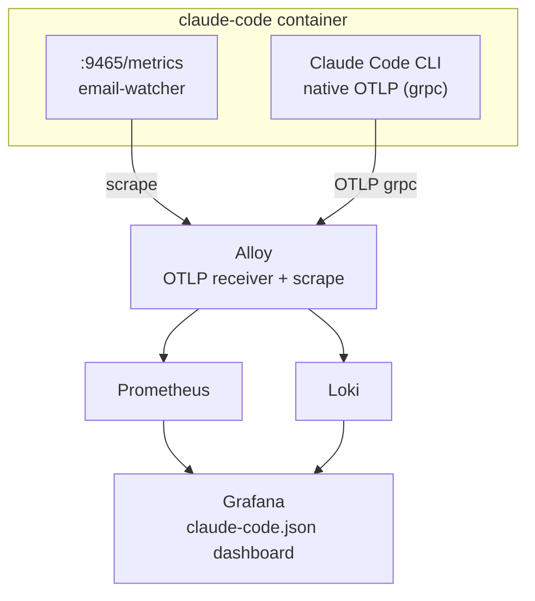

# UC-1A: Email Workflow Observability

Two metric sources feed Grafana dashboards: email-watcher Prometheus scrape and Claude Code native OTLP telemetry.

## Architecture



**Local dev:** Alloy + Prometheus + Loki + Grafana run as a sidecar stack via [`local/docker-compose.yml`](../local/docker-compose.yml).

**Production:** Host Alloy (shared across all stacks) scrapes email-watcher on port 9465 and receives OTLP on port 4317. Config at `compose.stacks/_shared-infra/alloy/config.alloy`.

## UC-1A.1: Inbox Backlog

Emails waiting for processing, broken down by source (gmail/outlook).

**Metric:** `email_watcher_backlog_total{source}` — count of emails with `status="new"`.

**Code:** [`email-watcher.ts:119-136`](../claude-code/channels/email-watcher.ts#L119) — SQL query groups `status='new'` by source.

## UC-1A.2: Attachment Tracking

Emails with attachments, by source and processing status.

**Metric:** `email_watcher_attachments_total{source, status}` — count of `has_attachments=1` emails.

**Code:** [`email-watcher.ts:138-161`](../claude-code/channels/email-watcher.ts#L138) — SQL groups by source + status where `has_attachments = 1`.

## UC-1A.3: Workflow Actions

Distribution of classifier decisions across the pipeline.

**Metric:** `email_watcher_actions_total{action}` — count by action (download_and_upload, notify_user, ignore).

**Code:** [`email-watcher.ts:188-205`](../claude-code/channels/email-watcher.ts#L188) — SQL groups non-null actions.

## UC-1A.4: Correspondent Mix

Top correspondents from completed invoice workflow jobs (normalized names from Paperless fuzzy matching).

**Metric:** `invoice_worker_correspondents_total{correspondent}` — OTLP counter pushed from `workflow-mcp`. Seeded from historical completed jobs at startup, incremented on each new upload.

**Dashboard panel:** "Top Correspondents" (bar gauge, queries `invoice_worker_correspondents_total`).

**Code:** [`invoice-worker.ts`](../claude-code/channels/invoice-worker.ts) — counter defined and seeded via `seedCounterFromDb()`, incremented after `completeJob()` on successful upload. [`workflow-mcp.ts`](../claude-code/channels/workflow-mcp.ts) — `getMeter("workflow")` initializes the OTel meter.

**Legacy:** `email_watcher_vendors_total{vendor}` (scraped from email-watcher `/metrics`) still exists but uses raw classifier vendor names (inconsistent naming). The dashboard now uses the OTLP correspondent metric instead.

## UC-1A.5: Confidence and Latency

Classification confidence distribution and end-to-end workflow latency.

**Metrics:**
- `email_watcher_confidence_total{confidence}` — emails by confidence level (high/medium/low)
- `email_watcher_latency_seconds{stage}` — average seconds from discovery to classification/processing

**Code:**
- [`email-watcher.ts:207-226`](../claude-code/channels/email-watcher.ts#L207) — confidence grouping
- [`email-watcher.ts:267-298`](../claude-code/channels/email-watcher.ts#L267) — latency calculation using `julianday()` diff

Additional metrics:
- `email_watcher_emails_total{source, status}` — total emails tracked
- `email_watcher_recent_discovered_total{source, status}` — last 24h discovery counts
- `email_watcher_processed_results_total{status}` — final processing outcomes

## UC-1A.6: Claude Telemetry

Claude Code exports native OpenTelemetry data (meter: `com.anthropic.claude_code`).

**Env vars** on claude-code container ([`docker-compose.yml:34-43`](../docker-compose.yml#L34)):
```
CLAUDE_CODE_ENABLE_TELEMETRY=1
OTEL_EXPORTER_OTLP_ENDPOINT=${OTEL_ENDPOINT}
OTEL_EXPORTER_OTLP_PROTOCOL=grpc
OTEL_LOG_TOOL_DETAILS=1
```

**Key metrics (Prometheus via Alloy):**

| Metric | Attributes |
|--------|------------|
| `claude_code_token_usage_tokens_total` | `type` (input/output/cacheRead/cacheCreation), `model` |
| `claude_code_cost_usage_USD_total` | `model` |
| `claude_code_session_count_total` | — |
| `claude_code_active_time_seconds_total` | `type` (user/cli) |

**Key events (Loki via Alloy):**

| Event | Key attributes |
|-------|---------------|
| `claude_code.api_request` | model, cost_usd, duration_ms, tokens |
| `claude_code.tool_result` | tool_name, success, duration_ms, mcp_server_scope |
| `claude_code.tool_decision` | tool_name, decision, source |

## Metrics Server

The email-watcher runs a Bun HTTP server on port 9465 with two endpoints:

- `/health` — returns 200 if DB accessible and last poll < 2.5 minutes ago, 503 otherwise
- `/metrics` — Prometheus text format with all `email_watcher_*` metrics

**Code:** [`email-watcher.ts:304-332`](../claude-code/channels/email-watcher.ts#L304) — `startMetricsServer()`: health staleness check + metrics rendering.

## Grafana Dashboard

Pre-provisioned dashboard at [`observability/dashboards/claude-code.json`](../local/observability/dashboards/claude-code.json).

Datasource provisioning: [`observability/provisioning/`](../local/observability/provisioning/) — auto-configures Prometheus + Loki datasources for Grafana.

## Config Files

| File | Purpose |
|------|---------|
| [`observability/alloy-config.alloy`](../local/observability/alloy-config.alloy) | Local dev: OTLP receiver + Prometheus remote_write + Loki push |
| [`observability/prometheus-config.yml`](../local/observability/prometheus-config.yml) | Local dev: scrape config for Prometheus |
| [`observability/loki-config.yml`](../local/observability/loki-config.yml) | Local dev: Loki storage config |
| `_shared-infra/alloy/config.alloy` | Production: shared host Alloy with OTLP + email-watcher scrape |
