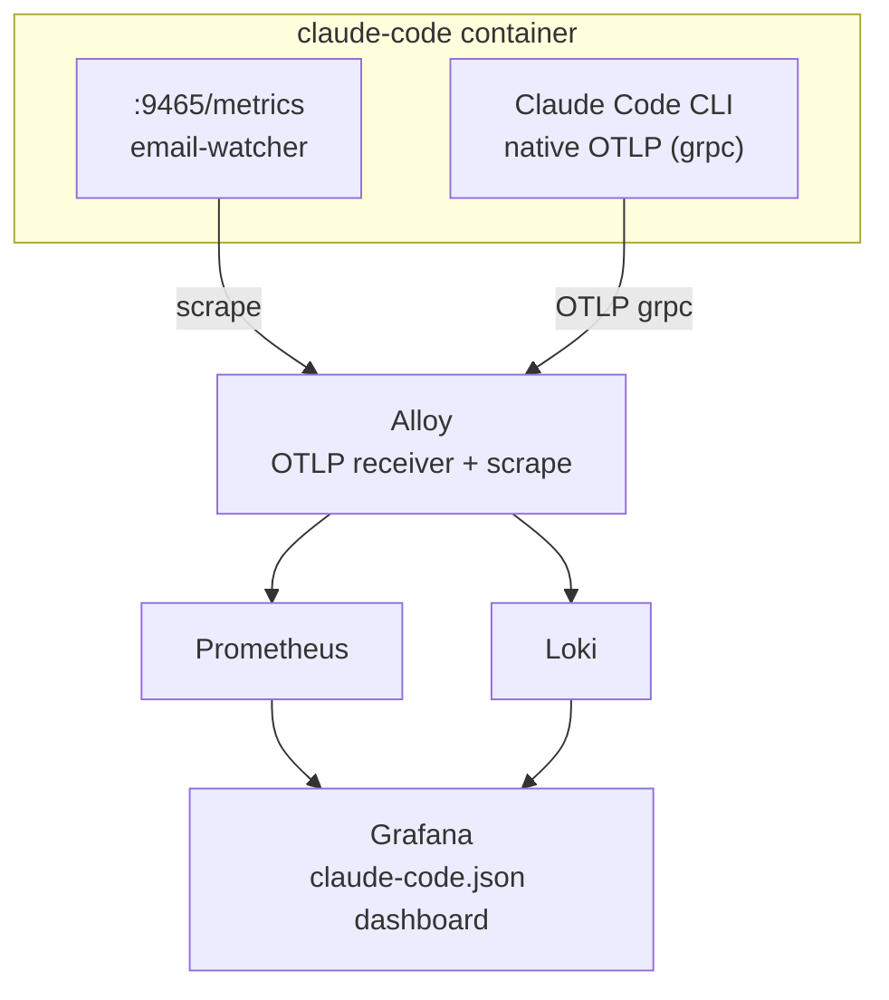

# UC-1A: Email Workflow Observability

Two metric sources feed Grafana dashboards: email-watcher Prometheus scrape and Claude Code native OTLP telemetry.

## Architecture



**Local dev:** Alloy + Prometheus + Loki + Grafana run as sidecar services via the `local` profile in [`docker-compose.yml`](../docker-compose.yml).

**Production:** Use your shared monitoring stack to scrape email-watcher on port 9465 and receive OTLP on port 4317, or point `OTEL_ENDPOINT` at your own receiver.

## Distributed Traces

The pipeline produces end-to-end distributed traces from watcher poll to final upload. Traces are exported via OTLP alongside metrics.

### Span hierarchy

```
email-watcher.poll
└── email-watcher.job_created (per email)

gdrive-watcher.poll
└── gdrive-watcher.job_created (per file)

workflow.execute_job invoice_intake
└── invoice-worker.execute {vendor} → {outcome}
    ├── invoice-worker.download
    ├── invoice-worker.resolve_correspondent
    ├── invoice-worker.dedup
    ├── invoice-worker.resolve_tags
    ├── invoice-worker.upload
    └── invoice-worker.set_fields

workflow.execute_job scan_intake
└── scan-worker.execute {vendor} → {outcome}
    ├── invoice-worker.resolve_correspondent
    ├── invoice-worker.dedup
    ├── invoice-worker.resolve_tags
    ├── invoice-worker.upload
    ├── invoice-worker.set_fields
    └── invoice-worker.move_file
```

### Trace propagation

1. **Watcher** creates a span for each poll cycle and captures the active trace ID.
2. **Job creation** stores the trace ID in the `jobs.trace_id` column.
3. **Worker** reads `job.trace_id` and creates its execution span as a child of the watcher's trace context.
4. All spans in a job's lifecycle connect back to the watcher poll that discovered the email or file.

### Classification gap

When the worker parks a job for classification (`awaiting_classification`), the execution span ends. Claude's classification work (fetch email, run Haiku subagent, submit result) happens in a separate Claude Code session span tree. The resumed worker execution creates a new span. Both spans share the same job trace, but there is no explicit span link between the parking span and Claude's classification work.

## Email-watcher metrics (OTLP push from `email-watcher`, meter: `email-watcher`)

All email-watcher metrics are observable gauges pushed via OTLP from
`email-watcher.ts`. They reflect the *current state* of the
audit DB and the workflow ledger — there are no per-event counters.

| Metric | Type | Attributes | Source |
|--------|------|------------|--------|
| `email_watcher.emails` | Observable gauge | `source` (gmail/outlook) | `SELECT source, COUNT(*) FROM emails GROUP BY source` |
| `email_watcher.attachments` | Observable gauge | `source` | `SELECT source, COUNT(*) FROM emails WHERE has_attachments = 1 GROUP BY source` |
| `email_watcher.recent_discovered` | Observable gauge | `source` | `SELECT source, COUNT(*) FROM emails WHERE discovered_at >= datetime('now', '-1 day') GROUP BY source` |
| `email_watcher.jobs` | Observable gauge | `type` (workflow_type), `state` | `SELECT workflow_type, state, COUNT(*) FROM jobs GROUP BY workflow_type, state` |
| `email_watcher.backlog` | Observable gauge | `type` (workflow_type) | `SELECT workflow_type, COUNT(*) FROM jobs WHERE state NOT IN ('completed', 'failed') GROUP BY workflow_type` (always observes both `invoice_intake` and `scan_intake`, including zero, so Prometheus sees fresh samples) |

**Code:** [`email-watcher.ts:registerMetrics()`](../claude-code/channels/email-watcher.ts) — defines all five gauges via `meter.createObservableGauge(...).addCallback(...)`.

## Invoice worker metrics (OTLP push from `workflow-mcp`, meter: `invoice-worker`)

| Metric | Type | Attributes | Source |
|--------|------|------------|--------|
| `invoice_worker_correspondents_total` | Counter | `correspondent` | Seeded from completed jobs at startup via `seedCounterFromDb()`; incremented after each successful upload |
| `invoice_worker_missing_month_tag_total` | Counter | `workflow_type` (`invoice_intake` / `scan_intake`) | Incremented when the worker uploads a doc without a valid YYYY-MM tag (LLM-driven `accounting_period` chain fully fell through; operator must tag manually) |

**Dashboard panel:** "Top Correspondents" (bar gauge, queries `invoice_worker_correspondents_total`).

**Code:** [`invoice/intake-worker.ts`](../claude-code/channels/invoice/intake-worker.ts) — counters defined near the top via `meter.createCounter(...)`, seeded by `seedCounterFromDb()`, `correspondentsCounter.add()` after `completeJob()` on success, `missingMonthTagCounter.add()` when month tag resolution fails.

## GDrive watcher metrics (OTLP push from `gdrive-watcher`, meter: `gdrive-watcher`)

| Metric | Type | Source |
|--------|------|--------|
| `gdrive_watcher.files` | Observable gauge | `SELECT COUNT(*) FROM gdrive_files` |
| `gdrive_watcher.last_poll_seconds_ago` | Observable gauge | `(Date.now() - lastSuccessfulPollAt) / 1000` |

**Code:** [`gdrive-watcher.ts:registerMetrics()`](../claude-code/channels/gdrive-watcher.ts).

## UC-1A.6: Claude Telemetry

Claude Code exports native OpenTelemetry data (meter: `com.anthropic.claude_code`).

**Env vars** on claude-code container ([`docker-compose.yml:34-43`](../docker-compose.yml#L34)):
```
CLAUDE_CODE_ENABLE_TELEMETRY=1
OTEL_EXPORTER_OTLP_ENDPOINT=${OTEL_ENDPOINT}
OTEL_EXPORTER_OTLP_PROTOCOL=grpc
OTEL_LOG_TOOL_DETAILS=1
```

**Key metrics (Prometheus via Alloy):**

| Metric | Attributes |
|--------|------------|
| `claude_code_token_usage_tokens_total` | `type` (input/output/cacheRead/cacheCreation), `model` |
| `claude_code_cost_usage_USD_total` | `model` |
| `claude_code_session_count_total` | — |
| `claude_code_active_time_seconds_total` | `type` (user/cli) |

**Key events (Loki via Alloy):**

| Event | Key attributes |
|-------|---------------|
| `claude_code.api_request` | model, cost_usd, duration_ms, tokens |
| `claude_code.tool_result` | tool_name, success, duration_ms, mcp_server_scope |
| `claude_code.tool_decision` | tool_name, decision, source |

## Metrics Server

The email-watcher runs a Bun HTTP server on port 9465 with two endpoints:

- `/health` — returns 200 if DB accessible and last poll < 2.5 minutes ago, 503 otherwise
- `/metrics` — Prometheus text format with all `email_watcher_*` metrics

**Code:** [`email-watcher.ts:304-332`](../claude-code/channels/email-watcher.ts#L304) — `startMetricsServer()`: health staleness check + metrics rendering.

## Grafana Dashboard

Pre-provisioned dashboard at [`observability/dashboards/claude-code.json`](../observability/dashboards/claude-code.json).

Datasource provisioning: [`observability/provisioning/`](../observability/provisioning/) — auto-configures Prometheus + Loki datasources for Grafana.

## Config Files

| File | Purpose |
|------|---------|
| [`observability/alloy-config.alloy`](../observability/alloy-config.alloy) | Local dev: OTLP receiver + Prometheus remote_write + Loki push |
| [`observability/prometheus-config.yml`](../observability/prometheus-config.yml) | Local dev: scrape config for Prometheus |
| [`observability/loki-config.yml`](../observability/loki-config.yml) | Local dev: Loki storage config |
| your shared Alloy or OTLP config | Production: telemetry receiver and scrape configuration |
