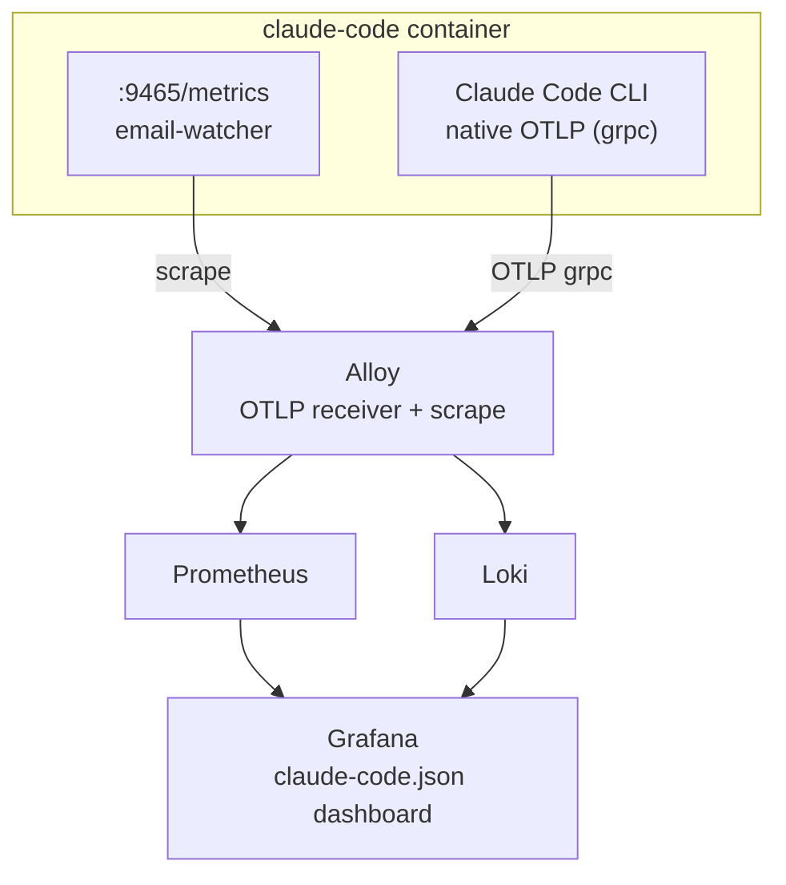

# UC-1A: Email Workflow Observability

Two metric sources feed Grafana dashboards: email-watcher Prometheus scrape and Claude Code native OTLP telemetry.

## Architecture


```mermaid
flowchart TB
    subgraph claude_code["claude-code container"]
        ew[":9465/metrics<br/>email-watcher"]
        otel["Claude Code CLI<br/>native OTLP (grpc)"]
    end

    alloy["Alloy<br/>OTLP receiver + scrape"]

    ew -->|scrape| alloy
    otel -->|OTLP grpc| alloy

    alloy --> prometheus["Prometheus"]
    alloy --> loki["Loki"]

    prometheus --> grafana["Grafana<br/>claude-code.json dashboard"]
    loki --> grafana
```

**Local dev:** Alloy + Prometheus + Loki + Grafana run as sidecar services via the `local` profile in [`docker-compose.yml`](../docker-compose.yml).

**Production:** Use your shared monitoring stack to scrape email-watcher on port 9465 and receive OTLP on port 4317, or point `OTEL_ENDPOINT` at your own receiver.

## Distributed Traces

The pipeline produces end-to-end distributed traces from watcher poll to final upload. Traces are exported via OTLP alongside metrics.

### Span hierarchy

```
email-watcher.poll
└── email-watcher.job_created (per email)

gdrive-watcher.poll
└── gdrive-watcher.job_created (per file)

workflow.execute_job invoice_intake
└── invoice-worker.execute {vendor} → {outcome}
    ├── classification-wait          (sentinel; duration = time parked for classify_email)
    ├── invoice-worker.download
    │   └── invoice-worker.gdrive_download  (when GDrive strategy)
    ├── classification-wait          (sentinel; duration = time parked for classify_document)
    ├── invoice-worker.resolve_correspondent
    ├── invoice-worker.dedup
    ├── invoice-worker.resolve_tags
    ├── invoice-worker.upload
    │   └── paperless-adapter.wait_for_consumption
    └── invoice-worker.set_fields

workflow.execute_job scan_intake
└── scan-worker.execute {vendor} → {outcome}
    ├── classification-wait          (sentinel; duration = time parked for classify_document)
    ├── invoice-worker.resolve_correspondent
    ├── invoice-worker.dedup
    ├── invoice-worker.resolve_tags
    ├── invoice-worker.upload
    │   └── paperless-adapter.wait_for_consumption
    ├── invoice-worker.set_fields
    └── invoice-worker.move_file
```

### Trace propagation

1. **Watcher** creates a span for each poll cycle and captures the active trace ID.
2. **Job creation** stores the trace ID in the `jobs.trace_id` column.
3. **Worker** reads `job.trace_id` and creates its execution span as a child of the watcher's trace context.
4. All spans in a job's lifecycle connect back to the watcher poll that discovered the email or file.

### Classification gap (closed)

When the worker parks a job for classification (`awaiting_classification`), the execution span ends. Claude's classification work happens in a separate Claude Code session span tree. Both spans share the same job trace.

The wait time is captured retroactively as a `classification-wait` sentinel span, emitted at resume time. At park time, the worker stores the active OTel span context and timestamp in the `classification_request_meta` job event (`sentinel_trace_id`, `sentinel_parent_span_id`, `sentinel_start_ms`). On resume, [`emitSentinelSpan`](./../../claude-code/channels/invoice/intake-worker.ts) reads these fields back and emits a child span with the stored start time — duration equals the actual classification wait. The sentinel appears as a child of `invoice-worker.execute` in the same trace.

## Email poller metrics (OTLP push from `email-poller`, meter: `email-poller`)

Pushed via OTLP from [`pollers/email-poller/src/main.ts`](../pollers/email-poller/src/main.ts).
The gauges below reflect the *current state* of the audit DB and the workflow ledger; the
three guard counters at the end are per-event.

> **The meter was renamed, the series were not.** The pollers moved out of `claude-code`
> into their own containers and the meters became `email-poller` / `gdrive-poller`, but the
> emitted series still start `email_watcher.` / `gdrive_watcher.` -- dashboards and alert
> rules query those names, so renaming them would break both silently.

| Metric | Type | Attributes | Source |
|--------|------|------------|--------|
| `email_watcher.emails` | Observable gauge | `source` (gmail/outlook) | `SELECT source, COUNT(*) FROM emails GROUP BY source` |
| `email_watcher.attachments` | Observable gauge | `source` | `SELECT source, COUNT(*) FROM emails WHERE has_attachments = 1 GROUP BY source` |
| `email_watcher.recent_discovered` | Observable gauge | `source` | `SELECT source, COUNT(*) FROM emails WHERE discovered_at >= datetime('now', '-1 day') GROUP BY source` |
| `email_watcher.jobs` | Observable gauge | `type` (workflow_type), `state` | `SELECT workflow_type, state, COUNT(*) FROM jobs GROUP BY workflow_type, state` |
| `email_watcher.backlog` | Observable gauge | `type` (workflow_type) | `SELECT workflow_type, COUNT(*) FROM jobs WHERE state NOT IN ('completed', 'failed') GROUP BY workflow_type` (always observes both `invoice_intake` and `scan_intake`, including zero, so Prometheus sees fresh samples) |

Three counters guard against silently losing email, and any of them being non-zero is a
signal, not noise:

| Metric | Fires when |
|--------|-----------|
| `email_watcher.catchup_overflow` | one cycle saw more than `MAX_CATCHUP_EMAILS` new emails for a source; the cursor is **held**, not advanced |
| `email_watcher.new_cap_exceeded` | an over-cap cycle processed the oldest N and held the cursor so the rest drains next poll |
| `email_watcher.search_page_full` | a provider page came back full (200) -- true pagination is deferred, and this counter is the cue to build it |

**Code:** [`pollers/email-poller/src/main.ts`](../pollers/email-poller/src/main.ts) --
gauges via `meter.createObservableGauge(...).addCallback(...)`. Note that file contains
literal NUL bytes, so `grep -I` and ripgrep skip it silently; search it with
`command grep -a` or Python.

## Invoice worker metrics (OTLP push from `pa-worker`, meter: `invoice-worker`)

| Metric | Meaning |
|--------|---------|
| `invoice_worker_correspondents_total` | Completed invoices by normalised Paperless correspondent. Seeded from the DB at startup, incremented on each upload. Drives the "Top Correspondents" panel. |
| `invoice_worker_missing_month_tag_total` | Documents uploaded without a valid `YYYY-MM` accounting period, labelled by `workflow_type`. Non-zero means the `accounting_period` resolution chain fell all the way through and the document needs manual tagging. |
| `personal_assistant_guidance_requests_total` | Jobs paused in `awaiting_user_guidance`, labelled by `reason` (`classifier_unknown`, `encrypted_pdf`, ...). Pairs with the `email_watcher.jobs{state="awaiting_user_guidance"}` gauge for current backlog. |
| `invoice_worker_sample_skipped_total` | Sample/preview invoices detected and skipped before upload, labelled by `vendor`. Non-zero means a download link served a watermarked non-tax document; check whether a follow-up with the real invoice arrived, then re-run the job. |
| `invoice_worker_accountant_skipped_total` | Accountant emails skipped by the intent gate, labelled by `reason`. Non-zero is expected and benign -- but a spike on `query` with a real invoice missing means a delivery was mis-skipped. |
| `invoice_worker_failed_total` | Terminal job failures, labelled by `reason` and `workflow_type`, zero-seeded at startup. |

**`invoice_worker_failed_total` has a coverage subtlety worth knowing.** Two of its reasons
-- `invalid_input` and `schema_validation_failed` -- are raised by guards that fire **before**
the email-carrying span exists, so the trace never captures them. For those two the counter
plus the per-incident `job.failed` Loki line (both emitted from `failJob`) are the only
signal. The rest span intake errors, dispatcher-level failures (`worker_exception`), wedged
jobs exhausting retries (`stale_timeout`) and jobs auto-failed after 72 h awaiting guidance
(`timed_out`).

**Code:** [`claude-code/channels/invoice/intake-steps/observability.ts`](../claude-code/channels/invoice/intake-steps/observability.ts)
defines the meter and counters; `failJob` in [`shared/workflow/jobs.ts`](../shared/workflow/jobs.ts)
emits both the counter and the `job.failed` line.

## GDrive poller metrics (OTLP push from `gdrive-poller`, meter: `gdrive-poller`)

| Metric | Type | Source |
|--------|------|--------|
| `gdrive_watcher.files` | Observable gauge | `SELECT COUNT(*) FROM gdrive_files` |
| `gdrive_watcher.last_poll_seconds_ago` | Observable gauge | `(Date.now() - lastSuccessfulPollAt) / 1000` |

**Code:** [`pollers/gdrive-poller/src/main.ts`](../pollers/gdrive-poller/src/main.ts).

## UC-1A.6: Claude Telemetry

Claude Code exports native OpenTelemetry data (meter: `com.anthropic.claude_code`).

**Env vars** on claude-code container ([`docker-compose.yml:34-43`](../docker-compose.yml#L34)):
```
CLAUDE_CODE_ENABLE_TELEMETRY=1
OTEL_EXPORTER_OTLP_ENDPOINT=${OTEL_ENDPOINT}
OTEL_EXPORTER_OTLP_PROTOCOL=grpc
OTEL_LOG_TOOL_DETAILS=1
```

**Key metrics (Prometheus via Alloy):**

| Metric | Attributes |
|--------|------------|
| `claude_code_token_usage_tokens_total` | `type` (input/output/cacheRead/cacheCreation), `model` |
| `claude_code_cost_usage_USD_total` | `model` |
| `claude_code_session_count_total` | — |
| `claude_code_active_time_seconds_total` | `type` (user/cli) |

**Key events (Loki via Alloy):**

| Event | Key attributes |
|-------|---------------|
| `claude_code.api_request` | model, cost_usd, duration_ms, tokens |
| `claude_code.tool_result` | tool_name, success, duration_ms, mcp_server_scope |
| `claude_code.tool_decision` | tool_name, decision, source |

## Metrics Server

The email-watcher runs a Bun HTTP server on port 9465 with two endpoints:

- `/health` — returns 200 if DB accessible and last poll < 2.5 minutes ago, 503 otherwise
- `/metrics` — Prometheus text format with all `email_watcher_*` metrics

**Code:** [`email-watcher.ts:304-332`](../claude-code/channels/email-watcher.ts#L304) — `startMetricsServer()`: health staleness check + metrics rendering.

## Grafana Dashboard

Pre-provisioned dashboard at [`observability/dashboards/claude-code.json`](../observability/dashboards/claude-code.json).

Datasource provisioning: [`observability/provisioning/`](../observability/provisioning/) — auto-configures Prometheus + Loki datasources for Grafana.

## Config Files

| File | Purpose |
|------|---------|
| [`observability/alloy-config.alloy`](../observability/alloy-config.alloy) | Local dev: OTLP receiver + Prometheus remote_write + Loki push |
| [`observability/prometheus-config.yml`](../observability/prometheus-config.yml) | Local dev: scrape config for Prometheus |
| [`observability/loki-config.yml`](../observability/loki-config.yml) | Local dev: Loki storage config |
| your shared Alloy or OTLP config | Production: telemetry receiver and scrape configuration |

## Events (Loki, via OTel logs)

| Event | Key attributes |
|-------|---------------|
| `claude_code.api_request` | model, cost_usd, duration_ms, input/output/cache tokens |
| `claude_code.api_error` | model, error, status_code, attempt |
| `claude_code.tool_result` | tool_name, success, duration_ms, mcp_server_scope |
| `claude_code.tool_decision` | tool_name, decision, source |
| `claude_code.user_prompt` | prompt length |
| `guidance.requested` | `job_id`, `reason` -- the worker parked a job in `awaiting_user_guidance` |
| `guidance.received` | `job_id`, `action` -- the user called `provide_guidance` |
| `guidance.applied` | `job_id`, `action` -- the worker consumed the guidance on resume |
| `job.failed` | `job_id`, `reason` (the `failJob` code). Emitted on **every** terminal failure, including the two pre-span guards that never produce a trace, so this is the per-incident companion to `invoice_worker_failed_total` and what drives the "Recent Failures" table. Line format: `job.failed job_id=<id> reason=<code>`. |
