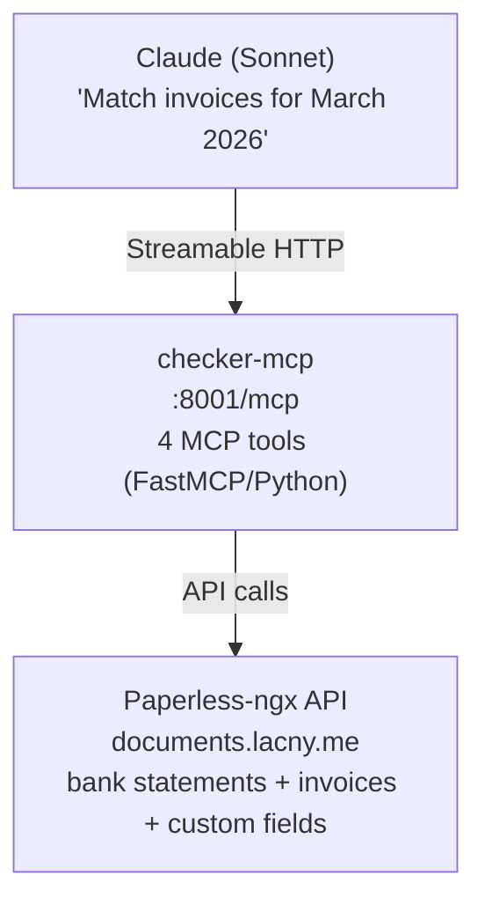

# UC-2: Invoice Matching & Accountant

Match bank statement movements against Paperless-ngx invoices. Detect missing invoices and generate P&L summaries.

## Architecture



The checker-mcp wraps the same matching engine used by the [Invoice Checker webapp](../../../media-gpu/paperless/local/checker/CLAUDE.md) (`match_invoices.py`). It's copied into the container at build time.

## UC-2.1: Match Invoices

Match a month's bank statement against invoices stored in Paperless.

**Tools:**
- `match_invoices(month)` — single month matching
- `match_invoices_range(month_from, month_to)` — multi-month with cross-month resolution

**How it works:**
1. Fetch bank statement document for the month (document type: `account_statement`)
2. Parse movements from the statement (date, amount, description)
3. For each movement, search for matching invoices by amount + date window + correspondent
4. Return rows with status: `matched`, `missing`, `excluded`, `manual`

**Code:**
- [`checker-mcp/server.py:55-72`](../local/checker-mcp/server.py#L55) — `match_invoices()` tool: calls `collect_month()` from engine
- [`checker-mcp/server.py:75-103`](../local/checker-mcp/server.py#L75) — `match_invoices_range()` tool: iterates months, applies `filter_resolved_unmatched()`
- [`checker-mcp/match_invoices.py`](../local/checker-mcp/match_invoices.py) — matching engine (shared with webapp): `collect_month()` at L515-577, movement parsing at L203-283

**Cross-month resolution:** `filter_resolved_unmatched()` removes movements marked "missing" in one month if they're matched in a later month (e.g., invoice dated Dec, payment in Jan).

## UC-2.2: Report Mismatches

Quick status check showing how many movements are matched, missing, or pending.

**Tool:** `get_month_status(month?)` — defaults to current month.

**Returns:**
```json
{
  "month": "2026-03",
  "stats": { "matched": 12, "missing": 3, "excluded": 2 },
  "has_statement": true,
  "missing_invoices": [
    { "amount": -49.99, "description": "CARD PAYMENT ALZA.SK" }
  ]
}
```

**Code:** [`checker-mcp/server.py:123-150`](../local/checker-mcp/server.py#L123) — `get_month_status()`: runs `collect_month()`, extracts stats + missing list.

## UC-2.7: P&L Summary

Annual profit & loss summary on accrual basis.

**Tool:** `get_pl_summary(year)` — returns income, expenses by category, excluded totals, net income.

**Code:** [`checker-mcp/server.py:106-120`](../local/checker-mcp/server.py#L106) — `get_pl_summary()`: calls `collect_pl()` from engine. Engine implementation at [`match_invoices.py:841-1051`](../local/checker-mcp/match_invoices.py#L841).

## Lazy Client

The Paperless API client is initialized lazily on first tool call, resolving document type IDs, custom field IDs, and tag IDs once.

**Code:** [`checker-mcp/server.py:27-49`](../local/checker-mcp/server.py#L27) — `_ClientHolder` singleton: resolves `statement_type_id`, `total_amount_field_id`, `total_amount_alt_field_id`, `invoicing_tag_id`.

## Not Yet Implemented

| # | Use Case | Notes |
|---|----------|-------|
| 2.3 | Generate monthly ZIP for accountant | `create_accountant_zip` not implemented |
| 2.4 | Draft accountant email with ZIP | `draft_accountant_email` not implemented |
| 2.5 | Send email after user approval | Requires explicit OK (block-level) |
| 2.6 | Month-end auto-check (cron) | Needs cron-scheduler channel |
