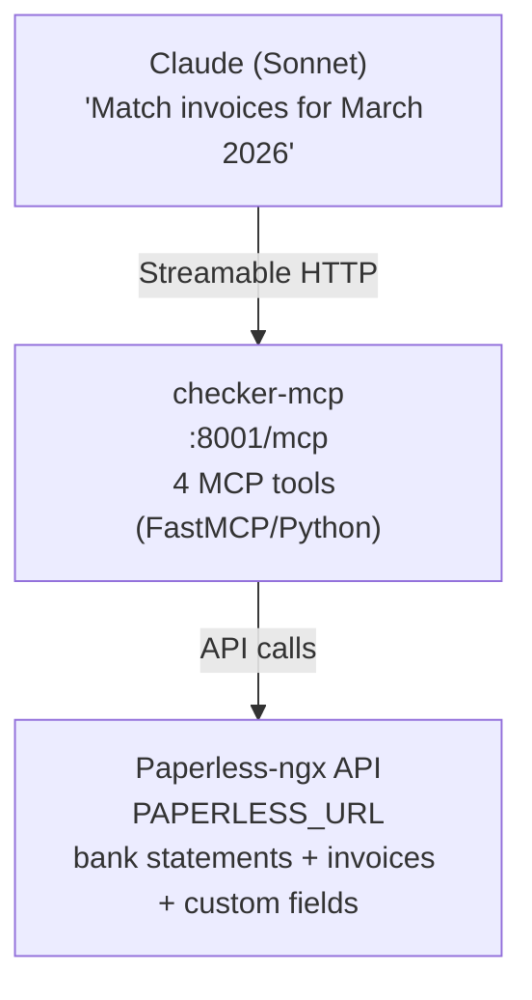

# UC-2: Invoice Matching & Accountant

Match bank statement movements against Paperless-ngx invoices. Detect missing invoices and generate P&L summaries.

## Architecture



The checker-mcp wraps the same matching engine used by the bundled checker web UI in this repository (`match_invoices.py`).

## UC-2.1: Match Invoices

Match a month's bank statement against invoices stored in Paperless.

**Tools:**
- `match_invoices(month)` — single month matching
- `match_invoices_range(month_from, month_to)` — multi-month with cross-month resolution

**How it works:**
1. Fetch bank statement document for the month (document type: `account_statement`)
2. Parse movements from the statement (date, amount, description, counterparty account token)
3. Detect returned-payment pairs (bounced transfer + its refund, same account + amount) — both legs marked `RETURNED` before matching, so neither consumes an invoice
4. For each remaining movement, search for matching invoices by amount + date window + correspondent
5. Return rows with status: `matched`, `missing`, `excluded`, `manual`, or `RETURNED`

**Code:**
- [`checker-mcp/server.py:55-72`](../checker-mcp/server.py#L55) — `match_invoices()` tool: calls `collect_month()` from engine
- [`checker-mcp/server.py:75-103`](../checker-mcp/server.py#L75) — `match_invoices_range()` tool: iterates months, applies `filter_resolved_unmatched()`
- [`checker-mcp/match_invoices.py`](../checker-mcp/match_invoices.py) — matching engine (shared with webapp): `collect_month()` at L515-577, movement parsing at L203-283

**Cross-month resolution:** `filter_resolved_unmatched()` removes movements marked "missing" in one month if they're matched in a later month (e.g., invoice dated Dec, payment in Jan).

## UC-2.2: Report Mismatches

Quick status check showing how many movements are matched, missing, or pending.

**Tool:** `get_month_status(month?)` — defaults to current month.

**Returns:**
```json
{
  "month": "2026-03",
  "stats": { "matched": 12, "missing": 3, "excluded": 2 },
  "has_statement": true,
  "missing_invoices": [
    { "amount": -49.99, "description": "CARD PAYMENT ALZA.SK" }
  ]
}
```

**Code:** [`checker-mcp/server.py:123-150`](../checker-mcp/server.py#L123) — `get_month_status()`: runs `collect_month()`, extracts stats + missing list.

## UC-2.7: P&L Summary

Annual profit & loss summary on accrual basis.

**Tool:** `get_pl_summary(year)` — returns income, expenses by category, excluded totals, net income.

**Code:** [`checker-mcp/server.py:106-120`](../checker-mcp/server.py#L106) — `get_pl_summary()`: calls `collect_pl()` from engine. Engine implementation at [`match_invoices.py:841-1051`](../checker-mcp/match_invoices.py#L841).

## UC-2.8: Bundle Grouping

A single expense sometimes arrives as three separate Paperless documents - a pro-forma invoice (zálohová faktúra), a payment confirmation (faktúra k prijatej platbe), and the final tax invoice (daňový doklad) - but there is only one row in the bank statement. Without grouping, the matcher renders the bundle as three lines (one matched movement plus two unmatched extras that later escalate to MISSING).

The operator sets a shared string custom field `tx_group` on every document of one bundle (any shared token; the final invoice number / variabilný symbol is the natural choice). The checker groups fetched invoices by that value and, for each group of 2+, keeps one primary and drops the siblings before matching, so the siblings never consume a movement, never emit an unmatched row, and never reach the P&L fallback. The surviving primary row carries `bundle_docs` listing the suppressed siblings, rendered under the primary line in the web UI.

**Primary = latest issue date.** Selection uses [`_invoice_order_date`](../checker-mcp/engine/collection.py), which prefers the `receipt_datetime` custom field (the LLM-extracted issue date) and falls back to Paperless `created`; tie-break is highest document id. `receipt_datetime_field_id` is threaded through every surface (matching view, P&L, MCP tools, CLI) so all of them pick the same primary - the final invoice, which is issued last.

**Operator-owned.** The intake pipeline never writes `tx_group`; field registration ([`paperless-fields.ts`](../claude-code/channels/paperless-fields.ts)) only guarantees the field exists so the operator can set it in the Paperless UI. The feature is inert when the field is unset (`tx_group_field_id is None`) - output is identical to pre-feature.

**Code:** [`resolve_bundle_primaries`](../checker-mcp/engine/collection.py) in `engine/collection.py`, called from `collect_month` before the movement-matching loop. Design: [_tasks/106-invoice-bundle-grouping](../../../../_tasks/106-invoice-bundle-grouping/).

## Lazy Client

The Paperless API client is initialized lazily on first tool call, resolving document type IDs, custom field IDs, and tag IDs once.

**Code:** [`checker-mcp/server.py`](../checker-mcp/server.py) - `_ClientHolder` singleton: resolves the statement/invoice type ids, the accounting tag id, and the custom-field ids (`total_amount`, `total_amount_alt`, `tx_group`, `receipt_datetime`).

## Not Yet Implemented

| # | Use Case | Notes |
|---|----------|-------|
| 2.3 | Generate monthly ZIP for accountant | `create_accountant_zip` not implemented |
| 2.4 | Draft accountant email with ZIP | `draft_accountant_email` not implemented |
| 2.5 | Send email after user approval | Requires explicit OK (block-level) |
| 2.6 | Month-end auto-check (cron) | Needs cron-scheduler channel |
